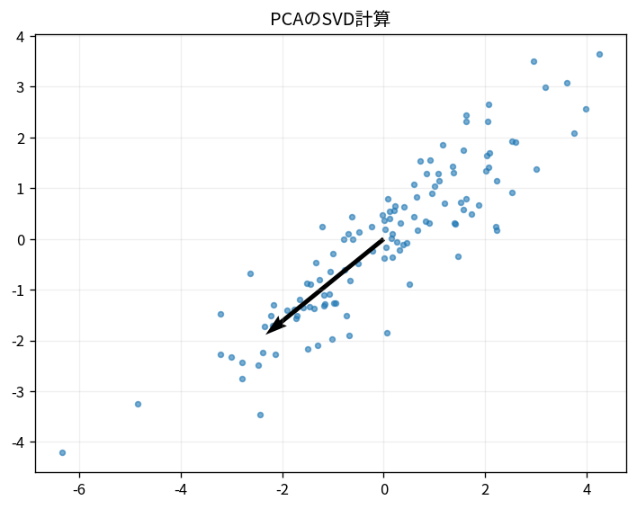

# PCAのSVD計算

Course 07｜データ解析の行列手法｜Topic 04/20

---
layout: center
---

## 今回の問い

## 到達目標

- 定義と代表式を、自分の言葉と記号で説明できる。
- 成立条件を確認し、手計算と結果を検算できる。

## 理解確認

- 定義・条件・計算結果を自分の言葉で説明できるか確認する。

PCAのSVD計算の代表式は、どの定義・仮定から、なぜその形になるのか。

---

## なぜ今これを学ぶのか

前Topic `mat-pca-geometry` で得た概念を使い、ここでは PCAのSVD計算 へ進む。

---

## 直感

PCAはデータの分散が大きい直交方向を順に選び、低次元へ射影する。

---

## 図解

細長い点群と主成分軸、射影点を描く。 点群の最も長い方向が第一主成分である。各点をその軸へ直交射影した座標の分散が最大になる方向を探す問題が固有値/SVDへつながる。

---

## 記号と代表式

- $X_c=U\Sigma V^T$
- $S=(n-1)^{-1}X_c^TX_c$
- $V$：principal directions
- $U\Sigma$：scores

$$
\mathbf{X}_c=\mathbf{U}\mathbf{\Sigma}\mathbf{V}^{\mathsf T}
$$

---

## 導出 1

$X_c^TX_c=V\Sigma U^TU\Sigma V^T=V\Sigma²V^T$。

---

## 導出 2

$S$ eigenvalueは $\lambda_i=\sigma_i²/(n-1)$。

---

## 例題

σ=(10,3,1), n=11ならvariance=(10,0.9,0.1)、total11、PC1 explained ratio10/11。

---

## 条件を変えるとどうなるか

singular valuesだけ見てloading方向を無視すると「どのfeature combinationか」が分からない。

---

## よくある誤解

PCAのSVD計算では、式へ数値を代入するだけでは不十分である。singular valuesだけ見てloading方向を無視すると「どのfeature combinationか」が分からない。 という失敗例が示すように、式を使える条件と結論の範囲を区別する必要がある。

---

## 実装・計算上の注意

randomized SVDでlarge data。sign of singular vector is arbitrary; run間sign flipはsame component。

---

## 一段先へ

covariance ellipseを球へ変換するwhiteningとMahalanobis distanceへ。

---

## 自分で説明できるか

- 「SへSVDを代入」を式を見ずに説明できるか
- 「scores」までの論理を一段ずつ再現できるか
- PCAのSVD計算の条件を1つ外した反例を説明できるか

---
layout: center
---

## 教科書と演習

- [教科書](../../textbook/mat-pca-svd-computation)
- [10問の演習](../../exercises/mat-pca-svd-computation)
