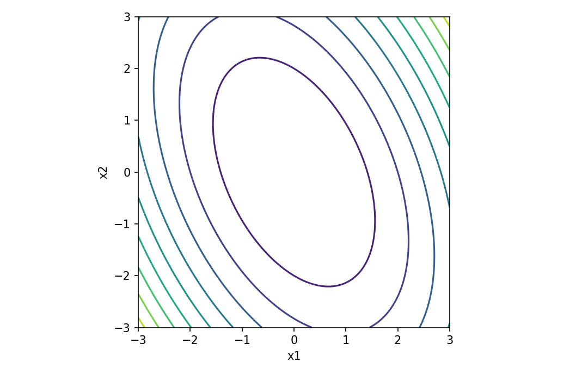

# Quadratic form derivatives

行列・ベクトル微分

---

## 問い

二次形式のgradient/Hessianを、対称性を意識してどう導くか。

---

## 記号とshape

- `$\mathbf x`: vector variable (n)
- `$\mathbf A`: fixed matrix (n\times n)
- `$f`: quadratic form (1)

---

## 中心式

$$
f(\mathbf x)=\mathbf x^{\mathsf T}\mathbf A\mathbf x,\quad \nabla f=(\mathbf A+\mathbf A^{\mathsf T})\mathbf x
$$

---

## 導出

- $df=(d\mathbf x)^{\mathsf T}\mathbf A\mathbf x+\mathbf x^{\mathsf T}\mathbf A d\mathbf x$。
- 第一項はscalar転置して $\mathbf x^{\mathsf T}\mathbf A^{\mathsf T}d\mathbf x$ と書ける。
- 係数をまとめると $df=[(\mathbf A+\mathbf A^{\mathsf T})\mathbf x]^{\mathsf T}d\mathbf x$。

---

## 図

---

## 小さな例

$\mathbf A=\begin{bmatrix}2&1\\0&3\end{bmatrix}$、$\mathbf x=(1,2)^{\mathsf T}$ ならgradientは $(\mathbf A+\mathbf A^{\mathsf T})\mathbf x=(6,13)^{\mathsf T}$。

---

## 何がわかるか

least squares、energy、Mahalanobis distance、Newton法の曲率解析に使う。

---

## 失敗条件

非対称行列でも二次形式は対称部分だけを見る。機械的に $2\mathbf A\mathbf x$ とすると誤る。

---

## 実装検算

`(A+A.T)@x` とfinite-difference gradientを比較し、Aが非対称でも一致することを確認する。

---

## 式の読み方を固定する

Quadratic form derivativesでは、局所線形化・内積・行列積のどこに微分対象が入るかを追う。$\mathbf x$ は vector variable（n）、$\mathbf A$ は fixed matrix（n\times n）、$f$ は quadratic form（1）。特に行列積は一般に可換でないため、中心式 `f(\mathbf x)=\mathbf x^{\mathsf T}\mathbf A\mathbf x,\quad \nabla f=(\mathbf A+\mathbf A^{\mathsf T})\mathbf x` の積順序を保持したままdifferentialまたはJacobianへ落とすことが重要である。転置を1つ動かしただけでshapeが変わるので、式変形ごとに入力次元と出力次元を再確認する。

---

## 極限・反例で検算

- 手計算例: $\mathbf A=\begin{bmatrix}2&1\\0&3\end{bmatrix}$、$\mathbf x=(1,2)^{\mathsf T}$ ならgradientは $(\mathbf A+\mathbf A^{\mathsf T})\mathbf x=(6,13)^{\mathsf T}$。
- 失敗条件: 非対称行列でも二次形式は対称部分だけを見る。機械的に $2\mathbf A\mathbf x$ とすると誤る。
- 実装検算: `(A+A.T)@x` とfinite-difference gradientを比較し、Aが非対称でも一致することを確認する。

---

## 工学での位置づけ

least squares、energy、Mahalanobis distance、Newton法の曲率解析に使う。

中心式 `f(\mathbf x)=\mathbf x^{\mathsf T}\mathbf A\mathbf x,\quad \nabla f=(\mathbf A+\mathbf A^{\mathsf T})\mathbf x` のどの量が観測・未知parameter・weight・frequency成分に対応するかを区別する。

---

## 試験で書けるべきこと

- `Quadratic form derivatives` の記号とshapeを定義する
- `$df=(d\mathbf x)^{\mathsf T}\mathbf A\mathbf x+\mathbf x^{\mathsf T}\mathbf A d\mathbf x$。` から中心式を導く
- `$\mathbf A=\begin{bmatrix}2&1\\0&3\end{bmatrix}$、$\mathbf x=(1,2)^{\mathsf T}$ ならgradientは $(\mathbf A+\mathbf A^{\mathsf T})\mathbf x=(6,13)^{\mathsf T}$。` を最後まで追う
- `非対称行列でも二次形式は対称部分だけを見る。機械的に $2\mathbf A\mathbf x$ とすると誤る。` がなぜ問題か説明する

---

## 接続

Prerequisites: mat-scalar-by-vector-derivative, la-quadratic-forms-positive-definite

[教科書](../../textbook/mat-quadratic-form-derivatives)
[10問の演習](../../exercises/mat-quadratic-form-derivatives)
