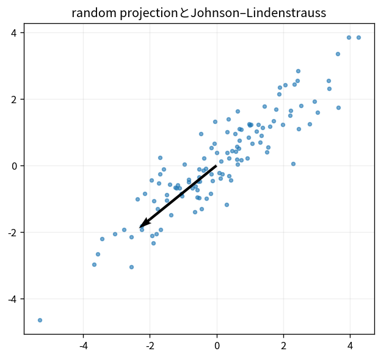

# random projectionとJohnson–Lindenstrauss

Course 07｜データ解析の行列手法｜Topic 17/20

---
layout: center
---

## 今回の問い

## 到達目標

- 定義と代表式を、自分の言葉と記号で説明できる。
- 成立条件を確認し、手計算と結果を検算できる。

## 理解確認

- 定義・条件・計算結果を自分の言葉で説明できるか確認する。

random projectionとJohnson–Lindenstraussの代表式は、どの定義・仮定から、なぜその形になるのか。

---

## なぜ今これを学ぶのか

前Topic `mat-cca-multiview` で得た概念を使い、ここでは random projectionとJohnson–Lindenstrauss へ進む。

---

## 直感

乱択法は高次元構造を完全に読む代わりに、ランダムな部分空間へ写して主要情報を安価に捉える。

---

## 図解

高次元点間距離が低次元射影でも概ね保たれる様子を見る。 高次元点群を低次元へ写しても、ランダム写像を適切に正規化すれば点間距離が概ね保存される。元の距離と写像後距離の対応を散布として確認する。

---

## 記号と代表式

- $R\in\mathbb R^{k\times d}$：random projection
- $z=R x/\sqrt k$
- $\varepsilon$：許容distance distortion

$$
\mathbf{z}=\frac{1}{\sqrt{k}}\mathbf{R}\mathbf{x}
$$

---

## 導出 1

random isotropic RではE||Rx/√k||²=||x||²。独立rowのsumがconcentrationする。

---

## 導出 2

n点にはO(n²) pair。1 pair failure probabilityを十分小さくしunion boundすると全distance保存を高確率保証。

---

## 例題

10000 points, moderate εなら元dimension百万でもkはpoint数のlogに依存。

---

## 条件を変えるとどうなるか

JLは任意projectionが良いわけでなくrandom distribution/normalizationが条件。individual coordinate interpretabilityは失う。

---

## よくある誤解

random projectionとJohnson–Lindenstraussでは、式へ数値を代入するだけでは不十分である。JLは任意projectionが良いわけでなくrandom distribution/normalizationが条件。individual coordinate interpretabilityは失う。 という失敗例が示すように、式を使える条件と結論の範囲を区別する必要がある。

---

## 実装・計算上の注意

seed、distribution、sparsity、distance error quantileを記録。

---

## 一段先へ

missing entriesからlow-rank matrixを推定するmatrix completionへ。

---

## 自分で説明できるか

- 「固定vectorのnorm concentration」を式を見ずに説明できるか
- 「dimension」までの論理を一段ずつ再現できるか
- random projectionとJohnson–Lindenstraussの条件を1つ外した反例を説明できるか

---
layout: center
---

## 教科書と演習

- [教科書](../../textbook/mat-random-projections-jl)
- [10問の演習](../../exercises/mat-random-projections-jl)
