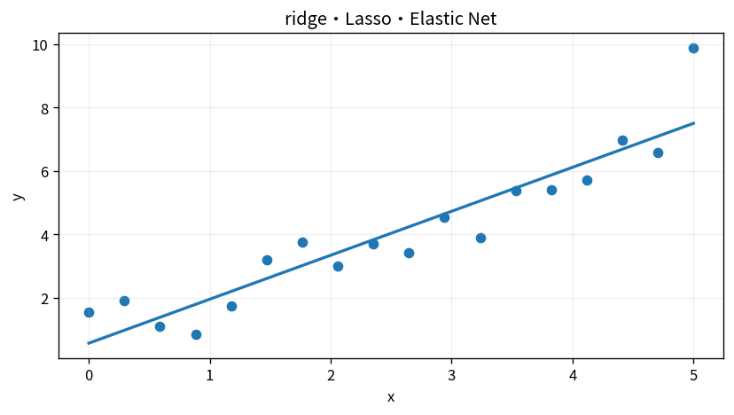

# ridge・Lasso・Elastic Net

Course 07｜データ解析の行列手法｜Topic 09/20

---
layout: center
---

## 今回の問い

## 到達目標

- 定義と代表式を、自分の言葉と記号で説明できる。
- 成立条件を確認し、手計算と結果を検算できる。

## 理解確認

- 定義・条件・計算結果を自分の言葉で説明できるか確認する。

ridge・Lasso・Elastic Netの代表式は、どの定義・仮定から、なぜその形になるのか。

---

## なぜ今これを学ぶのか

前Topic `mat-gls-correlated-errors` で得た概念を使い、ここでは ridge・Lasso・Elastic Net へ進む。

---

## 直感

正則化回帰はデータ適合と係数の複雑さを同時に最小化し、過学習を抑える。

---

## 図解

λを増やしたときの係数パスを描く。 データ適合だけの解と、係数の大きさに罰則を加えた解を比較する。罰則を強めるほど係数は縮み、variance低下とbias増加の交換が起きる。

---

## 記号と代表式

- $\lambda\ge0$
- $\|β\|_2²$：ridge penalty
- $\|β\|_1$：Lasso penalty
- $\alpha$：Elastic Net mix

$$
\min_{\boldsymbol{\beta}}\|\mathbf{X}\boldsymbol{\beta}-\mathbf{y}\|_2^2+\lambda\|\boldsymbol{\beta}\|_1
$$

---

## 導出 1

$J=\|Xβ-y\|²+λ\|β\|²$。gradient=0から $(X^TX+λI)β=X^Ty$。

---

## 導出 2

L1 ballはaxis上にcorner。quadratic loss contourがboundaryへ接する点がcornerになりやすく係数0。

---

## 例題

collinear featuresでridgeはcoefficientsを安定に分配しvarianceを減らす。

---

## 条件を変えるとどうなるか

Lassoが選んだfeatureが「真に重要」とは限らない。correlated featuresでは選択が不安定。

---

## よくある誤解

ridge・Lasso・Elastic Netでは、式へ数値を代入するだけでは不十分である。Lassoが選んだfeatureが「真に重要」とは限らない。correlated featuresでは選択が不安定。 という失敗例が示すように、式を使える条件と結論の範囲を区別する必要がある。

---

## 実装・計算上の注意

coordinate descent/proximal gradient、CVでλ選択。intercept penalize conventionを確認。

---

## 一段先へ

outlierへquadratic lossが敏感な問題はloss functionそのものをrobustに変えるM-estimationへ。

---

## 自分で説明できるか

- 「ridge normal equation」を式を見ずに説明できるか
- 「Bayesian view」までの論理を一段ずつ再現できるか
- ridge・Lasso・Elastic Netの条件を1つ外した反例を説明できるか

---
layout: center
---

## 教科書と演習

- [教科書](../../textbook/mat-ridge-lasso-elastic-net)
- [10問の演習](../../exercises/mat-ridge-lasso-elastic-net)
