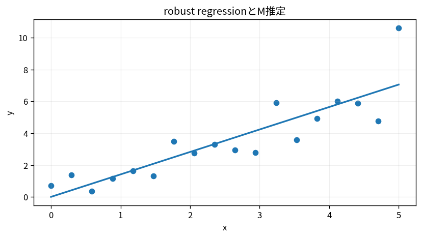

# robust regressionとM推定

Course 07｜データ解析の行列手法｜Topic 10/20

---
layout: center
---

## 今回の問い

## 到達目標

- 定義と代表式を、自分の言葉と記号で説明できる。
- 成立条件を確認し、手計算と結果を検算できる。

## 理解確認

- 定義・条件・計算結果を自分の言葉で説明できるか確認する。

robust regressionとM推定の代表式は、どの定義・仮定から、なぜその形になるのか。

---

## なぜ今これを学ぶのか

前Topic `mat-ridge-lasso-elastic-net` で得た概念を使い、ここでは robust regressionとM推定 へ進む。

---

## 直感

robust regressionは大きな残差の影響を二乗損失より弱め、外れ値に引っ張られにくくする。

---

## 図解

外れ値を含む散布図へOLSとHuber型の線を比較する。 二乗損失は大きな残差を二乗で強く罰するのに対し、Huber等は尾で増加を緩める。外れ値が回帰線をどれだけ引っ張るかの差として表れる。

---

## 記号と代表式

- $r_i=y_i-x_i^Tβ$
- $\rho(r)$：residual loss
- $\psi(r)=\rho^{\prime}(r)$：influence score

$$
\min_{\boldsymbol{\beta}}\sum_{i=1}^{n}\rho(r_i)
$$

---

## 導出 1

$\rho=r²/2$ ならψ=rでresidual大きさに比例し無制限に影響。

---

## 導出 2

小|r|でquadratic、大|r|でlinear。ψはclipされlarge outlierのgradient contributionがbounded。

---

## 例題

1点だけ巨大outlierを追加するとOLS lineが大きく引かれるがHuber fitは移動が小さい。

---

## 条件を変えるとどうなるか

robust estimatorも万能でなく、contamination割合やloss tuningでbias/efficiency tradeoff。

---

## よくある誤解

robust regressionとM推定では、式へ数値を代入するだけでは不十分である。robust estimatorも万能でなく、contamination割合やloss tuningでbias/efficiency tradeoff。 という失敗例が示すように、式を使える条件と結論の範囲を区別する必要がある。

---

## 実装・計算上の注意

scale estimateとHuber thresholdを同時に管理。convergence of IRLSをmonitor。

---

## 一段先へ

ここからsignal basisへ移り、Fourier基底で「dataを別coordinateで見る」考えを使う。

---

## 自分で説明できるか

- 「OLS influence」を式を見ずに説明できるか
- 「IRLS view」までの論理を一段ずつ再現できるか
- robust regressionとM推定の条件を1つ外した反例を説明できるか

---
layout: center
---

## 教科書と演習

- [教科書](../../textbook/mat-robust-regression-m-estimators)
- [10問の演習](../../exercises/mat-robust-regression-m-estimators)
