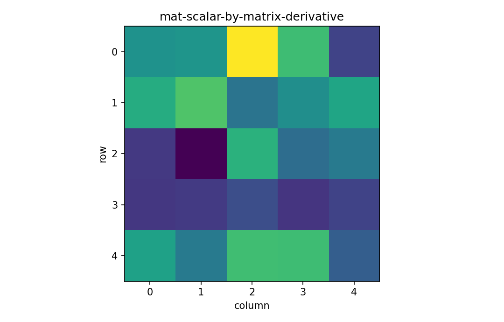

# スカラーを行列で微分する

行列・ベクトル微分

---

## 問い

行列の各要素を動かしたときのスカラー目的関数の感度を、行列shapeのままどう保持するか。

---

## 記号とshape

- `$f`: scalar objective (1)
- `$\mathbf X`: matrix variable (m\times n)
- `$\partial f/\partial\mathbf X`: matrix gradient (m\times n)

---

## 中心式

$$
df=\operatorname{tr}\!\left[\left(\frac{\partial f}{\partial\mathbf X}\right)^{\mathsf T}d\mathbf X\right]
$$

---

## 導出

- $df=\sum_{i,j}(\partial f/\partial X_{ij})dX_{ij}$ から出発する。
- Frobenius inner product $\langle\mathbf A,\mathbf B\rangle_F=\operatorname{tr}(\mathbf A^{\mathsf T}\mathbf B)$ を使う。
- すると全要素の和が1つのtraceへまとまり、gradientは $\mathbf X$ と同じshapeを持つ。

---

## 図

---

## 小さな例

$f(\mathbf X)=\|\mathbf X\|_F^2$ なら $df=2\operatorname{tr}(\mathbf X^{\mathsf T}d\mathbf X)$ より $\partial f/\partial\mathbf X=2\mathbf X$。

---

## 何がわかるか

matrix factorization、covariance fitting、deep learningのweight gradientに直結する。

---

## 失敗条件

要素微分をflattenしたまま戻さないと、行列積の左右関係を失う。Frobenius inner productでshapeを復元する。

---

## 実装検算

ランダム方向 `D` に対し `(f(X+hD)-f(X-hD))/(2h)` と `sum(grad*D)` を比較する。

---

## 式の読み方を固定する

スカラーを行列で微分するでは、局所線形化・内積・行列積のどこに微分対象が入るかを追う。$f$ は scalar objective（1）、$\mathbf X$ は matrix variable（m\times n）、$\partial f/\partial\mathbf X$ は matrix gradient（m\times n）。特に行列積は一般に可換でないため、中心式 `df=\operatorname{tr}\!\left[\left(\frac{\partial f}{\partial\mathbf X}\right)^{\mathsf T}d\mathbf X\right]` の積順序を保持したままdifferentialまたはJacobianへ落とすことが重要である。転置を1つ動かしただけでshapeが変わるので、式変形ごとに入力次元と出力次元を再確認する。

---

## 極限・反例で検算

- 手計算例: $f(\mathbf X)=\|\mathbf X\|_F^2$ なら $df=2\operatorname{tr}(\mathbf X^{\mathsf T}d\mathbf X)$ より $\partial f/\partial\mathbf X=2\mathbf X$。
- 失敗条件: 要素微分をflattenしたまま戻さないと、行列積の左右関係を失う。Frobenius inner productでshapeを復元する。
- 実装検算: ランダム方向 `D` に対し `(f(X+hD)-f(X-hD))/(2h)` と `sum(grad*D)` を比較する。

---

## 工学での位置づけ

matrix factorization、covariance fitting、deep learningのweight gradientに直結する。

中心式 `df=\operatorname{tr}\!\left[\left(\frac{\partial f}{\partial\mathbf X}\right)^{\mathsf T}d\mathbf X\right]` のどの量が観測・未知parameter・weight・frequency成分に対応するかを区別する。

---

## 試験で書けるべきこと

- `スカラーを行列で微分する` の記号とshapeを定義する
- `$df=\sum_{i,j}(\partial f/\partial X_{ij})dX_{ij}$ から出発する。` から中心式を導く
- `$f(\mathbf X)=\|\mathbf X\|_F^2$ なら $df=2\operatorname{tr}(\mathbf X^{\mathsf T}d\mathbf X)$ より $\partial f/\partial\mathbf X=2\mathbf X$。` を最後まで追う
- `要素微分をflattenしたまま戻さないと、行列積の左右関係を失う。Frobenius inner productでshapeを復元する。` がなぜ問題か説明する

---

## 接続

Prerequisites: mat-scalar-by-vector-derivative, la-matrix-multiplication

[教科書](../../textbook/mat-scalar-by-matrix-derivative)
[10問の演習](../../exercises/mat-scalar-by-matrix-derivative)
