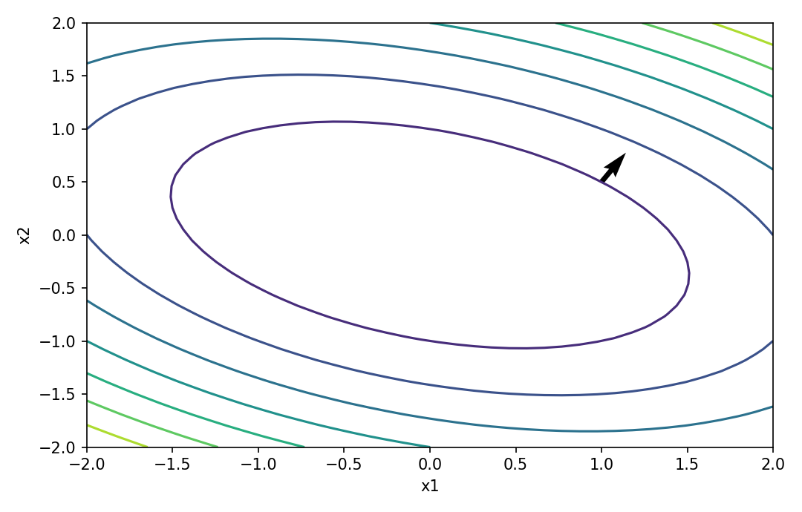

# スカラーをベクトルで微分する

行列・ベクトル微分

---

## 問い

スカラー関数の微小変化を、入力ベクトルの各方向の感度としてどう表すか。

---

## 記号とshape

- `$f`: scalar-valued function (1)
- `$\mathbf x`: input vector (n)
- `$\nabla f`: gradient (n)
- `$d\mathbf x`: infinitesimal perturbation (n)

---

## 中心式

$$
df=\nabla f(\mathbf x)^{\mathsf T}d\mathbf x,\qquad \nabla f=\begin{bmatrix}\partial f/\partial x_1&\cdots&\partial f/\partial x_n\end{bmatrix}^{\mathsf T}
$$

---

## 導出

- $f(\mathbf x+d\mathbf x)-f(\mathbf x)$ を一次までTaylor展開する。
- 各成分の寄与を集めると $df=\sum_i(\partial f/\partial x_i)dx_i$ になる。
- この係数を縦ベクトルに集めれば $df=\nabla f^{\mathsf T}d\mathbf x$ で、gradientのshapeが自動的に決まる。

---

## 図

---

## 小さな例

$f(x_1,x_2)=x_1^2+3x_1x_2$ では $\nabla f=(2x_1+3x_2,3x_1)^{\mathsf T}$。$(1,2)$ なら $(8,3)^{\mathsf T}$。

---

## 何がわかるか

損失関数の勾配、感度解析、最急降下法はすべてこの一次近似を使う。

---

## 失敗条件

gradientを行ベクトルと縦ベクトルで混在させるとchain ruleのshapeが崩れる。まずdifferentialのscalar性を基準に向きを決める。

---

## 実装検算

有限差分 `(f(x+h e_i)-f(x-h e_i))/(2h)` と解析gradientを成分ごとに比較する。

---

## 式の読み方を固定する

スカラーをベクトルで微分するでは、局所線形化・内積・行列積のどこに微分対象が入るかを追う。$f$ は scalar-valued function（1）、$\mathbf x$ は input vector（n）、$\nabla f$ は gradient（n）、$d\mathbf x$ は infinitesimal perturbation（n）。特に行列積は一般に可換でないため、中心式 `df=\nabla f(\mathbf x)^{\mathsf T}d\mathbf x,\qquad \nabla f=\begin{bmatrix}\partial f/\partial x_1&\cdots&\partial f/\partial x_n\end{bmatrix}^{\mathsf T}` の積順序を保持したままdifferentialまたはJacobianへ落とすことが重要である。転置を1つ動かしただけでshapeが変わるので、式変形ごとに入力次元と出力次元を再確認する。

---

## 極限・反例で検算

- 手計算例: $f(x_1,x_2)=x_1^2+3x_1x_2$ では $\nabla f=(2x_1+3x_2,3x_1)^{\mathsf T}$。$(1,2)$ なら $(8,3)^{\mathsf T}$。
- 失敗条件: gradientを行ベクトルと縦ベクトルで混在させるとchain ruleのshapeが崩れる。まずdifferentialのscalar性を基準に向きを決める。
- 実装検算: 有限差分 `(f(x+h e_i)-f(x-h e_i))/(2h)` と解析gradientを成分ごとに比較する。

---

## 工学での位置づけ

損失関数の勾配、感度解析、最急降下法はすべてこの一次近似を使う。

中心式 `df=\nabla f(\mathbf x)^{\mathsf T}d\mathbf x,\qquad \nabla f=\begin{bmatrix}\partial f/\partial x_1&\cdots&\partial f/\partial x_n\end{bmatrix}^{\mathsf T}` のどの量が観測・未知parameter・weight・frequency成分に対応するかを区別する。

---

## 試験で書けるべきこと

- `スカラーをベクトルで微分する` の記号とshapeを定義する
- `$f(\mathbf x+d\mathbf x)-f(\mathbf x)$ を一次までTaylor展開する。` から中心式を導く
- `$f(x_1,x_2)=x_1^2+3x_1x_2$ では $\nabla f=(2x_1+3x_2,3x_1)^{\mathsf T}$。$(1,2)$ なら $(8,3)^{\mathsf T}$。` を最後まで追う
- `gradientを行ベクトルと縦ベクトルで混在させるとchain ruleのshapeが崩れる。まずdifferentialのscalar性を基準に向きを決める。` がなぜ問題か説明する

---

## 接続

Prerequisites: calc-derivatives-rates, calc-multivariable-functions-partial-derivatives, la-vectors-linear-combinations

[教科書](../../textbook/mat-scalar-by-vector-derivative)
[10問の演習](../../exercises/mat-scalar-by-vector-derivative)
