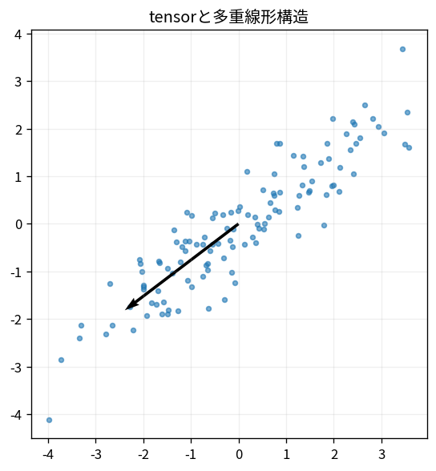

# tensorと多重線形構造

Course 07｜データ解析の行列手法｜Topic 20/20

---
layout: center
---

## 今回の問い

## 到達目標

- 定義と代表式を、自分の言葉と記号で説明できる。
- 成立条件を確認し、手計算と結果を検算できる。

## 理解確認

- 定義・条件・計算結果を自分の言葉で説明できるか確認する。

tensorと多重線形構造の代表式は、どの定義・仮定から、なぜその形になるのか。

---

## なぜ今これを学ぶのか

前Topic `mat-graph-spectral-methods` で得た概念を使い、ここでは tensorと多重線形構造 へ進む。

---

## 直感

tensorは3軸以上を持つデータを、軸構造を壊さず扱う表現。

---

## 図解

3次元配列をsliceとrank-1外積の和として図示する。 行列の2軸を3軸以上へ拡張した配列としてtensorを描く。各modeを固定・展開する操作が、行列分解を多方向へ一般化する入口になる。

---

## 記号と代表式

- $\mathcal X\in\mathbb R^{I\times J\times K}$：3-way tensor
- $\circ$：outer product
- $a_r\circ b_r\circ c_r$：rank-1 tensor
- $R$：CP components

$$
\mathcal{X}\approx\sum_{r=1}^{R}\mathbf{a}_r\circ\mathbf{b}_r\circ\mathbf{c}_r
$$

---

## 導出 1

$(a\circ b\circ c)_{ijk}=a_i b_j c_k$。各modeのfactorがmultiplicatively結合。

---

## 導出 2

$X_{ijk}\approx\sum_{r=1}^R a_{ir}b_{jr}c_{kr}$。matrix factorizationより多way structureを保つ。

---

## 例題

sample×gene×time dataを3-wayのままfactorizeし、sample pattern・gene pattern・time patternをcomponentごとに分ける。

---

## 条件を変えるとどうなるか

tensor rankはmatrix rankほど単純でなくbest low-rank approximationが存在しないcaseすらある。

---

## よくある誤解

tensorと多重線形構造では、式へ数値を代入するだけでは不十分である。tensor rankはmatrix rankほど単純でなくbest low-rank approximationが存在しないcaseすらある。 という失敗例が示すように、式を使える条件と結論の範囲を区別する必要がある。

---

## 実装・計算上の注意

ALS local minima/scale/permutation ambiguity。normalizationとmultiple startsを使う。

---

## 一段先へ

Course08ではこれらのmatrix/data representationsをpredictive modelとevaluation pipelineへ組み込む。

---

## 自分で説明できるか

- 「rank-1 entry」を式を見ずに説明できるか
- 「unfolding」までの論理を一段ずつ再現できるか
- tensorと多重線形構造の条件を1つ外した反例を説明できるか

---
layout: center
---

## 教科書と演習

- [教科書](../../textbook/mat-tensors-multilinear-overview)
- [10問の演習](../../exercises/mat-tensors-multilinear-overview)
