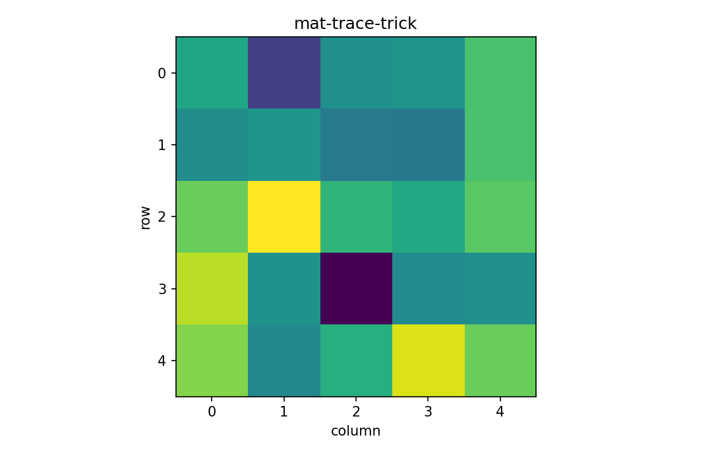

# Trace trick

行列・ベクトル微分

---

## 問い

複雑なmatrix differentialからgradientを読み取るため、どうtraceの巡回性を使うか。

---

## 記号とshape

- `$f`: scalar (1)
- `$\mathbf X`: matrix variable (m\times n)
- `$\mathbf G`: coefficient of differential (m\times n)

---

## 中心式

$$
df=\operatorname{tr}(\mathbf G^{\mathsf T}d\mathbf X)\quad\Longrightarrow\quad \frac{\partial f}{\partial\mathbf X}=\mathbf G
$$

---

## 導出

- scalarは自分自身のtraceなので $df=\operatorname{tr}(df)$ と書ける。
- $\operatorname{tr}(\mathbf A\mathbf B\mathbf C)=\operatorname{tr}(\mathbf C\mathbf A\mathbf B)$ の巡回性で $d\mathbf X$ を末尾へ移す。
- $\operatorname{tr}(\mathbf G^{\mathsf T}d\mathbf X)$ の形に揃えればFrobenius inner productからgradientを読める。

---

## 図

---

## 小さな例

$f=\operatorname{tr}(\mathbf A\mathbf X)$ なら $df=\operatorname{tr}(\mathbf A d\mathbf X)=\operatorname{tr}(\mathbf A^{\mathsf T\mathsf T}d\mathbf X)$ よりgradientは $\mathbf A^{\mathsf T}$。

---

## 何がわかるか

least squares、Gaussian log-likelihood、deep learningのmatrix gradientを短く安全に導出できる。

---

## 失敗条件

traceは巡回置換はできるが任意の並べ替えはできない。特に3因子以上で順序を勝手に反転しない。

---

## 実装検算

解析gradientとdirectional derivative `tr(G.T @ D)` を有限差分で比較する。

---

## 式の読み方を固定する

Trace trickでは、局所線形化・内積・行列積のどこに微分対象が入るかを追う。$f$ は scalar（1）、$\mathbf X$ は matrix variable（m\times n）、$\mathbf G$ は coefficient of differential（m\times n）。特に行列積は一般に可換でないため、中心式 `df=\operatorname{tr}(\mathbf G^{\mathsf T}d\mathbf X)\quad\Longrightarrow\quad \frac{\partial f}{\partial\mathbf X}=\mathbf G` の積順序を保持したままdifferentialまたはJacobianへ落とすことが重要である。転置を1つ動かしただけでshapeが変わるので、式変形ごとに入力次元と出力次元を再確認する。

---

## 極限・反例で検算

- 手計算例: $f=\operatorname{tr}(\mathbf A\mathbf X)$ なら $df=\operatorname{tr}(\mathbf A d\mathbf X)=\operatorname{tr}(\mathbf A^{\mathsf T\mathsf T}d\mathbf X)$ よりgradientは $\mathbf A^{\mathsf T}$。
- 失敗条件: traceは巡回置換はできるが任意の並べ替えはできない。特に3因子以上で順序を勝手に反転しない。
- 実装検算: 解析gradientとdirectional derivative `tr(G.T @ D)` を有限差分で比較する。

---

## 工学での位置づけ

least squares、Gaussian log-likelihood、deep learningのmatrix gradientを短く安全に導出できる。

中心式 `df=\operatorname{tr}(\mathbf G^{\mathsf T}d\mathbf X)\quad\Longrightarrow\quad \frac{\partial f}{\partial\mathbf X}=\mathbf G` のどの量が観測・未知parameter・weight・frequency成分に対応するかを区別する。

---

## 試験で書けるべきこと

- `Trace trick` の記号とshapeを定義する
- `scalarは自分自身のtraceなので $df=\operatorname{tr}(df)$ と書ける。` から中心式を導く
- `$f=\operatorname{tr}(\mathbf A\mathbf X)$ なら $df=\operatorname{tr}(\mathbf A d\mathbf X)=\operatorname{tr}(\mathbf A^{\mathsf T\mathsf T}d\mathbf X)$ よりgradientは $\mathbf A^{\mathsf T}$。` を最後まで追う
- `traceは巡回置換はできるが任意の並べ替えはできない。特に3因子以上で順序を勝手に反転しない。` がなぜ問題か説明する

---

## 接続

Prerequisites: mat-matrix-differential, mat-gram-matrix

[教科書](../../textbook/mat-trace-trick)
[10問の演習](../../exercises/mat-trace-trick)
