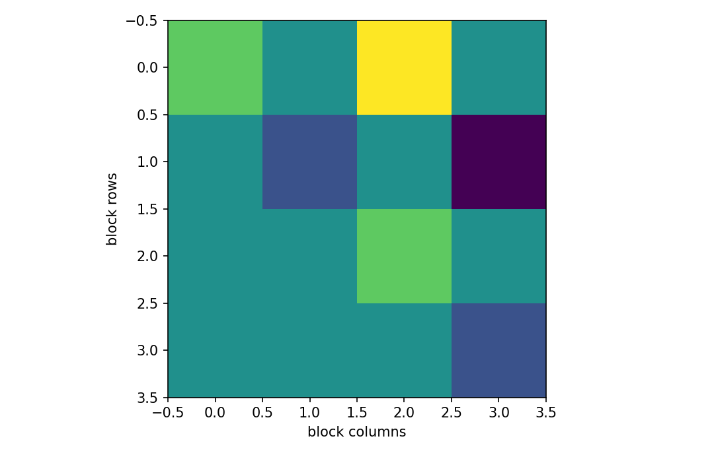

# vec operator

行列・ベクトル微分

---

## 問い

行列を1本のベクトルへ並べ、matrix equationを通常の線形代数へ落とすには。

---

## 記号とshape

- `$\mathbf X`: matrix (m\times n)
- `$\operatorname{vec}(\mathbf X)`: column-stacked vector (mn)
- `$\otimes`: Kronecker product (operator)

---

## 中心式

$$
\operatorname{vec}(\mathbf A\mathbf X\mathbf B)=(\mathbf B^{\mathsf T}\otimes\mathbf A)\operatorname{vec}(\mathbf X)
$$

---

## 導出

- まず $\operatorname{vec}$ の列優先規約を固定する。
- $\mathbf A\mathbf X\mathbf B$ の各列は $\mathbf A\mathbf X$ の列の線形結合である。
- 係数をblockとして並べると $\mathbf B^{\mathsf T}\otimes\mathbf A$ が現れる。

---

## 図

---

## 小さな例

$\mathbf X=\begin{bmatrix}1&2\\3&4\end{bmatrix}$ ならcolumn-major vecは $(1,3,2,4)^{\mathsf T}$。row-majorとの混同に注意する。

---

## 何がわかるか

Sylvester equation、matrix normal model、Kronecker covariance、matrix derivativeの表現に使う。

---

## 失敗条件

NumPyのdefault reshapeはC-orderで、数学のcolumn-major vecと異なることがある。規約を明示しない実装は危険。

---

## 実装検算

`X.reshape(-1, order="F")` とKronecker identityを小行列で検算する。

---

## 式の読み方を固定する

vec operatorでは、局所線形化・内積・行列積のどこに微分対象が入るかを追う。$\mathbf X$ は matrix（m\times n）、$\operatorname{vec}(\mathbf X)$ は column-stacked vector（mn）、$\otimes$ は Kronecker product（operator）。特に行列積は一般に可換でないため、中心式 `\operatorname{vec}(\mathbf A\mathbf X\mathbf B)=(\mathbf B^{\mathsf T}\otimes\mathbf A)\operatorname{vec}(\mathbf X)` の積順序を保持したままdifferentialまたはJacobianへ落とすことが重要である。転置を1つ動かしただけでshapeが変わるので、式変形ごとに入力次元と出力次元を再確認する。

---

## 極限・反例で検算

- 手計算例: $\mathbf X=\begin{bmatrix}1&2\\3&4\end{bmatrix}$ ならcolumn-major vecは $(1,3,2,4)^{\mathsf T}$。row-majorとの混同に注意する。
- 失敗条件: NumPyのdefault reshapeはC-orderで、数学のcolumn-major vecと異なることがある。規約を明示しない実装は危険。
- 実装検算: `X.reshape(-1, order="F")` とKronecker identityを小行列で検算する。

---

## 工学での位置づけ

Sylvester equation、matrix normal model、Kronecker covariance、matrix derivativeの表現に使う。

中心式 `\operatorname{vec}(\mathbf A\mathbf X\mathbf B)=(\mathbf B^{\mathsf T}\otimes\mathbf A)\operatorname{vec}(\mathbf X)` のどの量が観測・未知parameter・weight・frequency成分に対応するかを区別する。

---

## 試験で書けるべきこと

- `vec operator` の記号とshapeを定義する
- `まず $\operatorname{vec}$ の列優先規約を固定する。` から中心式を導く
- `$\mathbf X=\begin{bmatrix}1&2\\3&4\end{bmatrix}$ ならcolumn-major vecは $(1,3,2,4)^{\mathsf T}$。row-majorとの混同に注意する。` を最後まで追う
- `NumPyのdefault reshapeはC-orderで、数学のcolumn-major vecと異なることがある。規約を明示しない実装は危険。` がなぜ問題か説明する

---

## 接続

Prerequisites: mat-matrix-differential

[教科書](../../textbook/mat-vec-operator)
[10問の演習](../../exercises/mat-vec-operator)
