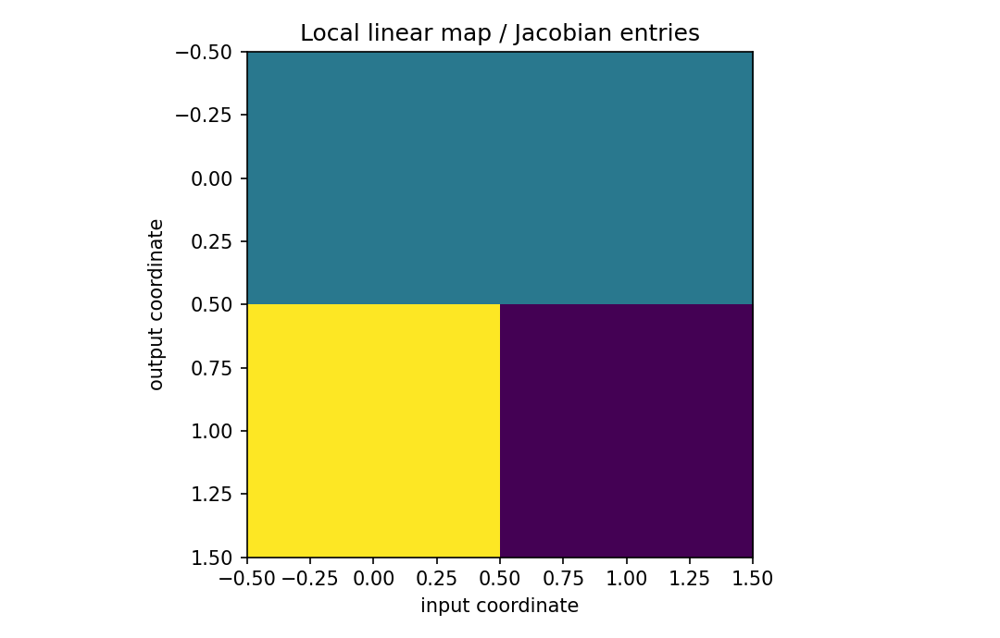

# ベクトルをベクトルで微分する：Jacobian

行列・ベクトル微分

---

## 問い

ベクトル入力の小変化が、ベクトル出力へどう線形伝播するか。

---

## 記号とshape

- `$\mathbf x`: input (n)
- `$\mathbf y=f(\mathbf x)`: output (m)
- `$\mathbf J_f`: Jacobian (m\times n)

---

## 中心式

$$
d\mathbf y=\mathbf J_f(\mathbf x)d\mathbf x,\qquad (\mathbf J_f)_{ij}=\frac{\partial f_i}{\partial x_j}
$$

---

## 導出

- 各出力 $f_i$ に対して $df_i=\sum_j(\partial f_i/\partial x_j)dx_j$ と書く。
- これを $m$ 本縦に積むと、係数配列が $m\times n$ のJacobianになる。
- したがって局所的に $f(\mathbf x+d\mathbf x)\approx f(\mathbf x)+\mathbf J_fd\mathbf x$。

---

## 図

---

## 小さな例

$f(x_1,x_2)=(x_1+x_2,x_1x_2)^{\mathsf T}$ なら $\mathbf J=\begin{bmatrix}1&1\\x_2&x_1\end{bmatrix}$。$(2,3)$ では $\begin{bmatrix}1&1\\3&2\end{bmatrix}$。

---

## 何がわかるか

非線形センサモデル、座標変換、ニューラルネットの局所線形化に使う。

---

## 失敗条件

Jacobianの転置規約を取り違えるとJVP/VJPが逆になる。入力次元が列数、出力次元が行数というshapeを固定する。

---

## 実装検算

`J @ dx` と実際の `f(x+dx)-f(x)` を小さい `dx` で比較し、誤差が二次で減ることを確かめる。

---

## 式の読み方を固定する

ベクトルをベクトルで微分する：Jacobianでは、局所線形化・内積・行列積のどこに微分対象が入るかを追う。$\mathbf x$ は input（n）、$\mathbf y=f(\mathbf x)$ は output（m）、$\mathbf J_f$ は Jacobian（m\times n）。特に行列積は一般に可換でないため、中心式 `d\mathbf y=\mathbf J_f(\mathbf x)d\mathbf x,\qquad (\mathbf J_f)_{ij}=\frac{\partial f_i}{\partial x_j}` の積順序を保持したままdifferentialまたはJacobianへ落とすことが重要である。転置を1つ動かしただけでshapeが変わるので、式変形ごとに入力次元と出力次元を再確認する。

---

## 極限・反例で検算

- 手計算例: $f(x_1,x_2)=(x_1+x_2,x_1x_2)^{\mathsf T}$ なら $\mathbf J=\begin{bmatrix}1&1\\x_2&x_1\end{bmatrix}$。$(2,3)$ では $\begin{bmatrix}1&1\\3&2\end{bmatrix}$。
- 失敗条件: Jacobianの転置規約を取り違えるとJVP/VJPが逆になる。入力次元が列数、出力次元が行数というshapeを固定する。
- 実装検算: `J @ dx` と実際の `f(x+dx)-f(x)` を小さい `dx` で比較し、誤差が二次で減ることを確かめる。

---

## 工学での位置づけ

非線形センサモデル、座標変換、ニューラルネットの局所線形化に使う。

中心式 `d\mathbf y=\mathbf J_f(\mathbf x)d\mathbf x,\qquad (\mathbf J_f)_{ij}=\frac{\partial f_i}{\partial x_j}` のどの量が観測・未知parameter・weight・frequency成分に対応するかを区別する。

---

## 試験で書けるべきこと

- `ベクトルをベクトルで微分する：Jacobian` の記号とshapeを定義する
- `各出力 $f_i$ に対して $df_i=\sum_j(\partial f_i/\partial x_j)dx_j$ と書く。` から中心式を導く
- `$f(x_1,x_2)=(x_1+x_2,x_1x_2)^{\mathsf T}$ なら $\mathbf J=\begin{bmatrix}1&1\\x_2&x_1\end{bmatrix}$。$(2,3)$ では $\begin{bmatrix}1&1\\3&2\end{bmatrix}$。` を最後まで追う
- `Jacobianの転置規約を取り違えるとJVP/VJPが逆になる。入力次元が列数、出力次元が行数というshapeを固定する。` がなぜ問題か説明する

---

## 接続

Prerequisites: mat-scalar-by-vector-derivative

[教科書](../../textbook/mat-vector-by-vector-derivative)
[10問の演習](../../exercises/mat-vector-by-vector-derivative)
