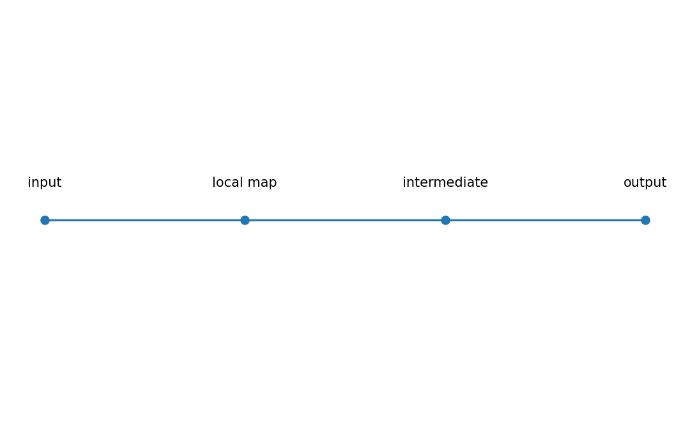

# Vector-Jacobian product (VJP)

行列・ベクトル微分

---

## 問い

scalar lossから多数の入力へgradientを戻すとき、Jacobian全体を作らずどう計算するか。

---

## 記号とshape

- `$\mathbf u`: output cotangent (m)
- `$\mathbf J_f`: Jacobian (m\times n)
- `$\mathbf u^{\mathsf T}\mathbf J_f`: input cotangent (n)

---

## 中心式

$$
\operatorname{VJP}(\mathbf u;f,\mathbf x)=\mathbf u^{\mathsf T}\mathbf J_f(\mathbf x)
$$

---

## 導出

- 外側scalar $L(\mathbf y)$ を置くと $dL=\nabla_{\mathbf y}L^{\mathsf T}d\mathbf y$。
- $d\mathbf y=\mathbf J_fd\mathbf x$ を代入する。
- $dL=(\mathbf J_f^{\mathsf T}\nabla_{\mathbf y}L)^{\mathsf T}d\mathbf x$ なのでbackpropはVJPの連鎖になる。

---

## 図

---

## 小さな例

$\mathbf u=(2,-1)^{\mathsf T}$、$\mathbf J=\begin{bmatrix}1&2\\3&4\end{bmatrix}$ なら $\mathbf u^{\mathsf T}\mathbf J=(-1,0)$。

---

## 何がわかるか

reverse-mode ADとbackpropagationの基本演算で、scalar loss・大量parameterに特に効率的。

---

## 失敗条件

VJPとJVPを同じ向きのvector multiplicationだと思うとshapeを誤る。VJPはoutput側からinput側へcotangentを戻す。

---

## 実装検算

autogradの`vjp`と `u @ J` を比較する。

---

## 式の読み方を固定する

Vector-Jacobian product (VJP)では、局所線形化・内積・行列積のどこに微分対象が入るかを追う。$\mathbf u$ は output cotangent（m）、$\mathbf J_f$ は Jacobian（m\times n）、$\mathbf u^{\mathsf T}\mathbf J_f$ は input cotangent（n）。特に行列積は一般に可換でないため、中心式 `\operatorname{VJP}(\mathbf u;f,\mathbf x)=\mathbf u^{\mathsf T}\mathbf J_f(\mathbf x)` の積順序を保持したままdifferentialまたはJacobianへ落とすことが重要である。転置を1つ動かしただけでshapeが変わるので、式変形ごとに入力次元と出力次元を再確認する。

---

## 極限・反例で検算

- 手計算例: $\mathbf u=(2,-1)^{\mathsf T}$、$\mathbf J=\begin{bmatrix}1&2\\3&4\end{bmatrix}$ なら $\mathbf u^{\mathsf T}\mathbf J=(-1,0)$。
- 失敗条件: VJPとJVPを同じ向きのvector multiplicationだと思うとshapeを誤る。VJPはoutput側からinput側へcotangentを戻す。
- 実装検算: autogradの`vjp`と `u @ J` を比較する。

---

## 工学での位置づけ

reverse-mode ADとbackpropagationの基本演算で、scalar loss・大量parameterに特に効率的。

中心式 `\operatorname{VJP}(\mathbf u;f,\mathbf x)=\mathbf u^{\mathsf T}\mathbf J_f(\mathbf x)` のどの量が観測・未知parameter・weight・frequency成分に対応するかを区別する。

---

## 試験で書けるべきこと

- `Vector-Jacobian product (VJP)` の記号とshapeを定義する
- `外側scalar $L(\mathbf y)$ を置くと $dL=\nabla_{\mathbf y}L^{\mathsf T}d\mathbf y$。` から中心式を導く
- `$\mathbf u=(2,-1)^{\mathsf T}$、$\mathbf J=\begin{bmatrix}1&2\\3&4\end{bmatrix}$ なら $\mathbf u^{\mathsf T}\mathbf J=(-1,0)$。` を最後まで追う
- `VJPとJVPを同じ向きのvector multiplicationだと思うとshapeを誤る。VJPはoutput側からinput側へcotangentを戻す。` がなぜ問題か説明する

---

## 接続

Prerequisites: mat-jacobian-vector-product

[教科書](../../textbook/mat-vector-jacobian-product)
[10問の演習](../../exercises/mat-vector-jacobian-product)
