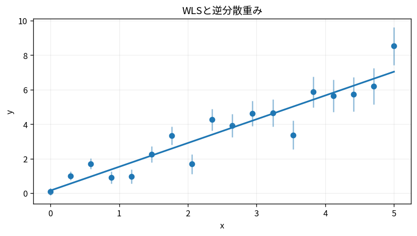
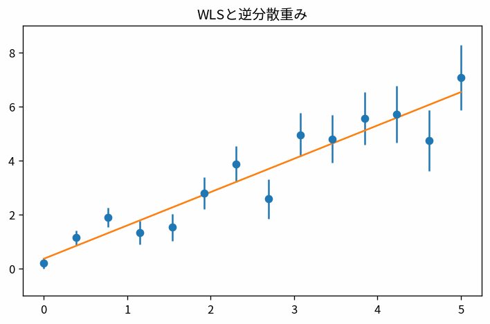

# WLSと逆分散重み

Course 07｜データ解析

---
layout: center
---

## 今回の問い

WLSと逆分散重みで、何を入力し、代表式がどの量を出力し、どの成立条件を外すと結果が壊れるのか。

---

## 到達目標

- WLSと逆分散重みの定義と代表式を言葉で説明できる
- 図と式の対応を説明できる
- 小さな例で成立条件と失敗条件を検算できる

---

## 直感

観測ごとの信頼度が異なるとき、残差を同じ重みで扱わず、分散の小さい観測を強く反映する。

**前提:** la-weighted-least-squares-introduction, stat-linear-regression-probabilistic-model

---

## 図解

---

## 図を見るポイント

- 軸・node・矢印・領域が何を表すか確認する
- 代表式の各項と図の要素を対応づける
- 条件を変えたとき、どこが変化するか予測する

---

## 代表式

$$
\hat{\boldsymbol{\beta}}=(\mathbf{X}^{\mathsf T}\mathbf{W}\mathbf{X})^{-1}\mathbf{X}^{\mathsf T}\mathbf{W}\mathbf{y}
$$

左辺の出力 → 右辺の操作 → 入力の型の順で読む。

---

## 式をどう読むか

- **対象:** WLS、逆分散重み
- shape・次元・定義域を先に確定する
- 計算後に符号・大きさ・残差・確率などを図と照合する

---

## 小さな例

同じ散布点にOLSと逆分散WLSを当て、誤差バーの小さい点へ線が寄る様子を見る。

最小の非自明な設定で、手計算と実装を照合する。

---

## 動き／思考実験で確認

- 各frameで、何が固定され何が更新されるかを追う。

---

## 成立条件

- Wは通常対称正定値を想定する。
- 重みを大きくする意味は「その点を信頼する」こと。
- WLSと逆分散重みの定義と計算手順を区別し、数値例だけで一般性を判断しない。

---

## よくある誤解

- WLSと逆分散重みの定義と計算手順を同一視する
- 成立条件を確認せず公式を適用する
- 数学上の次元と配列のshapeを混同する

---

## 数値・実装で検算

1. 小さい入力を作る
2. 定義式から期待値を手で求める
3. NumPy等の実装結果と比較する
4. shape・残差・許容誤差・seedを記録する

---

## 後続分野への接続

WLSと逆分散重みは、後続の数値計算・データ解析・機械学習で前提となる。

このTopicの量が、後続で入力・目的関数・制約・診断のどれとして使われるか確認する。

---

## まとめと演習

- WLSと逆分散重みを図→式→小例の順で説明できるか
- 条件を1つ外した反例を作れるか

[教科書](../../textbook/mat-wls-inverse-variance)

[10問の演習](../../exercises/mat-wls-inverse-variance)
