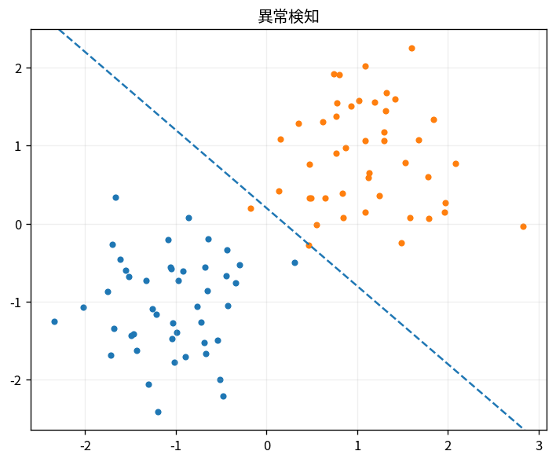

# 異常検知

Course 08｜機械学習｜Topic 15/20

---
layout: center
---

## 今回の問い

## 到達目標

- 定義と代表式を、自分の言葉と記号で説明できる。
- 成立条件を確認し、手計算と結果を検算できる。

## 理解確認

- 定義・条件・計算結果を自分の言葉で説明できるか確認する。

異常検知の代表式は、どの定義・仮定から、なぜその形になるのか。

---

## なぜ今これを学ぶのか

前Topic `ml-dimensionality-reduction-pca-manifold` で得た概念を使い、ここでは 異常検知 へ進む。

---

## 直感

異常検知は「通常データからどれだけ外れるか」のscoreを作り、閾値で判定する。

---

## 図解

密度の低い点を負対数尤度で高scoreにする。 高密度領域から離れた点ほど正常モデルの確率または近傍密度が小さくなる。閾値をどこに置くかでfalse positiveと見逃しが変わる。

---

## 記号と代表式

- $s(x)$：anomaly score
- $s=-\log p(x)$：density-based score例
- $\tau$：decision threshold

$$
s(\mathbf{x})=-\log p(\mathbf{x})
$$

---

## 導出 1

p(x)が小さいほどsurprisal -log pが大きい。

---

## 導出 2

flag=1[s(x)>τ]。τ変更でFPR/TPR tradeoff。

---

## 例題

1D normalで|z|大のpointsがhigh score。

---

## 条件を変えるとどうなるか

labelled rare classとunsupervised anomalyは同じ問題ではない。rare but valid subpopulationを誤検知し得る。

---

## よくある誤解

異常検知では、式へ数値を代入するだけでは不十分である。labelled rare classとunsupervised anomalyは同じ問題ではない。rare but valid subpopulationを誤検知し得る。 という失敗例が示すように、式を使える条件と結論の範囲を区別する必要がある。

---

## 実装・計算上の注意

thresholdはvalidation operational dataで校正。driftでnormal distributionが変わると再calibration。

---

## 一段先へ

performanceはinput representation/featuresに強く依存するためfeature engineering/selectionへ。

---

## 自分で説明できるか

- 「density view」を式を見ずに説明できるか
- 「high dimension caveat」までの論理を一段ずつ再現できるか
- 異常検知の条件を1つ外した反例を説明できるか

---
layout: center
---

## 教科書と演習

- [教科書](../../textbook/ml-anomaly-detection)
- [10問の演習](../../exercises/ml-anomaly-detection)
