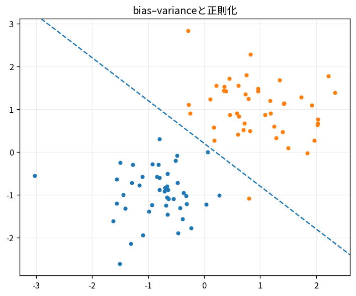

# bias–varianceと正則化

Course 08｜機械学習｜Topic 17/20

---
layout: center
---

## 今回の問い

## 到達目標

- 定義と代表式を、自分の言葉と記号で説明できる。
- 成立条件を確認し、手計算と結果を検算できる。

## 理解確認

- 定義・条件・計算結果を自分の言葉で説明できるか確認する。

bias–varianceと正則化の代表式は、どの定義・仮定から、なぜその形になるのか。

---

## なぜ今これを学ぶのか

前Topic `ml-feature-engineering-selection` で得た概念を使い、ここでは bias–varianceと正則化 へ進む。

---

## 直感

モデル複雑度を上げるとbiasは下がりvarianceが上がりやすく、汎化誤差には最適な中間がある。

---

## 図解

複雑度に対するtrain/test errorのU字曲線を描く。 単純すぎるモデルは複数標本で似た予測をするが系統誤差が大きく、複雑すぎるモデルは標本ごとに予測が大きく揺れる。

---

## 記号と代表式

- $f(x)=E[Y|X=x]$
- $\hat f_D$：dataset Dで学習したmodel
- $\sigma^2$：irreducible noise

$$
\mathbb{E}[(Y-\hat{f}(X))^2]=\text{bias}^2+\text{variance}+\text{noise}
$$

---

## 導出 1

$Y-\hat f=(Y-f)+(f-E_D\hat f)+(E_D\hat f-\hat f)$。

---

## 導出 2

noise conditional mean0、model fluctuation dataset平均0によりcross termsが消える。

---

## 例題

high-degree polynomialはlow train bias but high dataset-to-dataset variance。ridgeでcoefficients shrinkしvariance低下。

---

## 条件を変えるとどうなるか

train errorだけではbias/variance balanceを選べない。complex modelほど通常train errorは下がる。

---

## よくある誤解

bias–varianceと正則化では、式へ数値を代入するだけでは不十分である。train errorだけではbias/variance balanceを選べない。complex modelほど通常train errorは下がる。 という失敗例が示すように、式を使える条件と結論の範囲を区別する必要がある。

---

## 実装・計算上の注意

learning curves, CV variance、seed variation。

---

## 一段先へ

hyperparameter/model choiceをcross-validationでestimateする。

---

## 自分で説明できるか

- 「errorをtrue regression function周りで分ける」を式を見ずに説明できるか
- 「三成分」までの論理を一段ずつ再現できるか
- bias–varianceと正則化の条件を1つ外した反例を説明できるか

---
layout: center
---

## 教科書と演習

- [教科書](../../textbook/ml-bias-variance-regularization)
- [10問の演習](../../exercises/ml-bias-variance-regularization)
