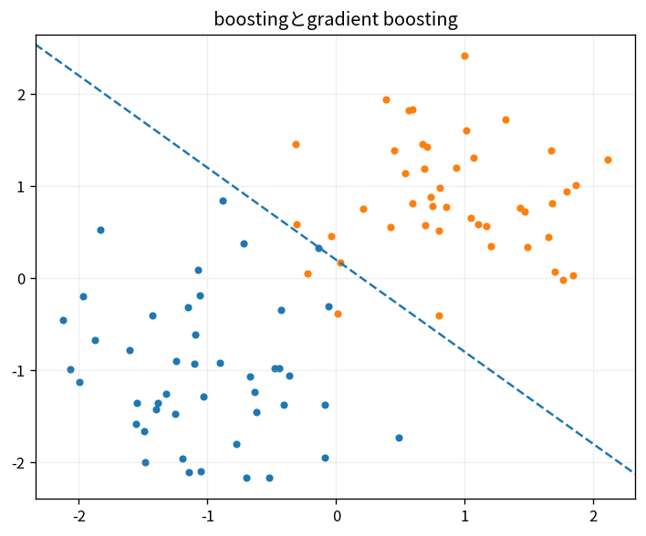

# boostingとgradient boosting

Course 08｜機械学習｜Topic 09/20

---
layout: center
---

## 今回の問い

## 到達目標

- 定義と代表式を、自分の言葉と記号で説明できる。
- 成立条件を確認し、手計算と結果を検算できる。

## 理解確認

- 定義・条件・計算結果を自分の言葉で説明できるか確認する。

boostingとgradient boostingの代表式は、どの定義・仮定から、なぜその形になるのか。

---

## なぜ今これを学ぶのか

前Topic `ml-ensembles-bagging-random-forests` で得た概念を使い、ここでは boostingとgradient boosting へ進む。

---

## 直感

boostingは前までの誤りを次の弱学習器が補うように加算モデルを構築する。

---

## 図解

1本目、2本目、3本目と予測曲線が残差へ適合する過程を見る。 弱学習器を順番に追加し、前段で残った誤差へ後段が焦点を当てる。最終予測は各学習器の寄与の加算として形成される。

---

## 記号と代表式

- $F_m$：m stage ensemble
- $h_m$：weak learner
- $\eta$：shrinkage
- $-\partial\ell/\partial F$：functional negative gradient

$$
F_m(\mathbf{x})=F_{m-1}(\mathbf{x})+\eta h_m(\mathbf{x})
$$

---

## 導出 1

各sample prediction F(x_i)に対するloss derivativeを計算。negative gradientが欲しいprediction change。

---

## 導出 2

$h_m(x_i)$ をpseudo-residualへregressionし、利用可能なtree family内で方向を近似。

---

## 例題

squared lossで最初constant mean、次treeが残差structureを説明し、stageごとに補正。

---

## 条件を変えるとどうなるか

training lossはstage追加で下がってもvalidationは悪化し得る。early stopping。

---

## よくある誤解

boostingとgradient boostingでは、式へ数値を代入するだけでは不十分である。training lossはstage追加で下がってもvalidationは悪化し得る。early stopping。 という失敗例が示すように、式を使える条件と結論の範囲を区別する必要がある。

---

## 実装・計算上の注意

XGBoost/LightGBMでobjective derivatives、subsampling、tree regularizationを確認。

---

## 一段先へ

margin最大化という別のclassification原理SVMへ。

---

## 自分で説明できるか

- 「functional gradient」を式を見ずに説明できるか
- 「step」までの論理を一段ずつ再現できるか
- boostingとgradient boostingの条件を1つ外した反例を説明できるか

---
layout: center
---

## 教科書と演習

- [教科書](../../textbook/ml-boosting-gradient-boosting)
- [10問の演習](../../exercises/ml-boosting-gradient-boosting)
