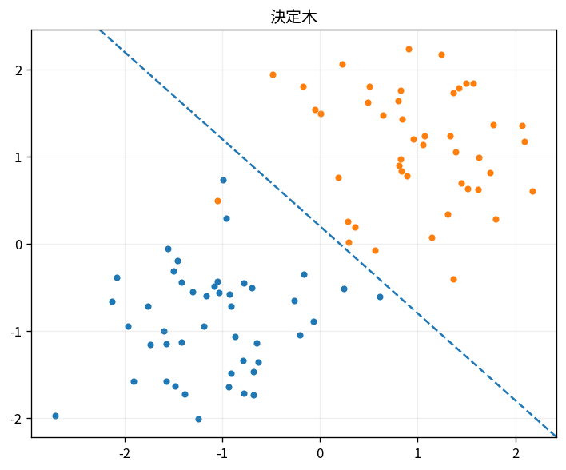

# 決定木

Course 08｜機械学習｜Topic 07/20

---
layout: center
---

## 今回の問い

## 到達目標

- 定義と代表式を、自分の言葉と記号で説明できる。
- 成立条件を確認し、手計算と結果を検算できる。

## 理解確認

- 定義・条件・計算結果を自分の言葉で説明できるか確認する。

決定木の代表式は、どの定義・仮定から、なぜその形になるのか。

---

## なぜ今これを学ぶのか

前Topic `ml-knn-distance-methods` で得た概念を使い、ここでは 決定木 へ進む。

---

## 直感

木モデルは特徴量のしきい値で入力空間を再帰的に分割し、ensembleは複数木のばらつきを平均化する。

---

## 図解

2次元空間の矩形分割を描く。 各分岐は1つの特徴量に対する条件、葉は最終予測である。木を深くするとtraining dataを細かく分けられる一方、varianceが上がる。

---

## 記号と代表式

- $H(Y)$：node impurity/entropy
- $IG$：split前後impurity reduction
- $v$：child branch

$$
\operatorname{IG}=H(Y)-\sum_v p(v)H(Y\mid v)
$$

---

## 導出 1

entropy/Giniでclass混合度をscalar化。

---

## 導出 2

split後は各child size probabilityでimpurityをweighted average。

---

## 例題

perfectly pure splitならchild entropy0でgain=parent entropy。

---

## 条件を変えるとどうなるか

high-cardinality categorical featureは多split choiceでgainを過大に見せる場合。

---

## よくある誤解

決定木では、式へ数値を代入するだけでは不十分である。high-cardinality categorical featureは多split choiceでgainを過大に見せる場合。 という失敗例が示すように、式を使える条件と結論の範囲を区別する必要がある。

---

## 実装・計算上の注意

missing values, class weights, min samples leafをvalidationで決定。

---

## 一段先へ

high-variance treeを多数平均してvarianceを下げるbagging/random forest。

---

## 自分で説明できるか

- 「node uncertainty」を式を見ずに説明できるか
- 「information gain」までの論理を一段ずつ再現できるか
- 決定木の条件を1つ外した反例を説明できるか

---
layout: center
---

## 教科書と演習

- [教科書](../../textbook/ml-decision-trees)
- [10問の演習](../../exercises/ml-decision-trees)
