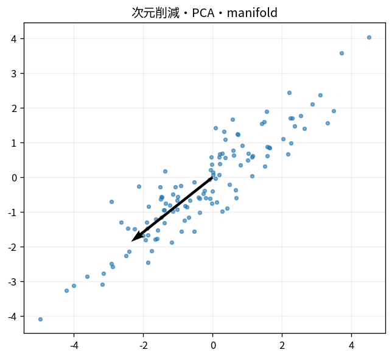

# 次元削減・PCA・manifold

Course 08｜機械学習｜Topic 14/20

---
layout: center
---

## 今回の問い

## 到達目標

- 定義と代表式を、自分の言葉と記号で説明できる。
- 成立条件を確認し、手計算と結果を検算できる。

## 理解確認

- 定義・条件・計算結果を自分の言葉で説明できるか確認する。

次元削減・PCA・manifoldの代表式は、どの定義・仮定から、なぜその形になるのか。

---

## なぜ今これを学ぶのか

前Topic `ml-gmm-em` で得た概念を使い、ここでは 次元削減・PCA・manifold へ進む。

---

## 直感

PCAはデータの分散が大きい直交方向を順に選び、低次元へ射影する。

---

## 図解

細長い点群と主成分軸、射影点を描く。 点群の最も長い方向が第一主成分である。各点をその軸へ直交射影した座標の分散が最大になる方向を探す問題が固有値/SVDへつながる。

---

## 記号と代表式

- $z=V_r^T(x-\mu)$：PCA coordinates
- $r<p$
- $V_r$：top principal directions

$$
\mathbf{z}=\mathbf{V}_r^{\mathsf T}(\mathbf{x}-\boldsymbol{\mu})
$$

---

## 導出 1

orthonormal V_rへprojectしてz。

---

## 導出 2

$\hat x=\mu+V_rz$。projection theoremでchosen subspace内nearest point。

---

## 例題

2D ellipseを1D PC1へ圧縮し長軸coordinateだけ残す。

---

## 条件を変えるとどうなるか

2D visualizationでcluster separationが見えてもdistance/global topologyがfaithfulとは限らない。

---

## よくある誤解

次元削減・PCA・manifoldでは、式へ数値を代入するだけでは不十分である。2D visualizationでcluster separationが見えてもdistance/global topologyがfaithfulとは限らない。 という失敗例が示すように、式を使える条件と結論の範囲を区別する必要がある。

---

## 実装・計算上の注意

fit reducer on train only。UMAP/t-SNE stochastic hyperparametersとout-of-sample transform有無を確認。

---

## 一段先へ

low-dimensional density/distanceを利用してanomaly detectionへ。

---

## 自分で説明できるか

- 「PCA encoder」を式を見ずに説明できるか
- 「best subspace」までの論理を一段ずつ再現できるか
- 次元削減・PCA・manifoldの条件を1つ外した反例を説明できるか

---
layout: center
---

## 教科書と演習

- [教科書](../../textbook/ml-dimensionality-reduction-pca-manifold)
- [10問の演習](../../exercises/ml-dimensionality-reduction-pca-manifold)
