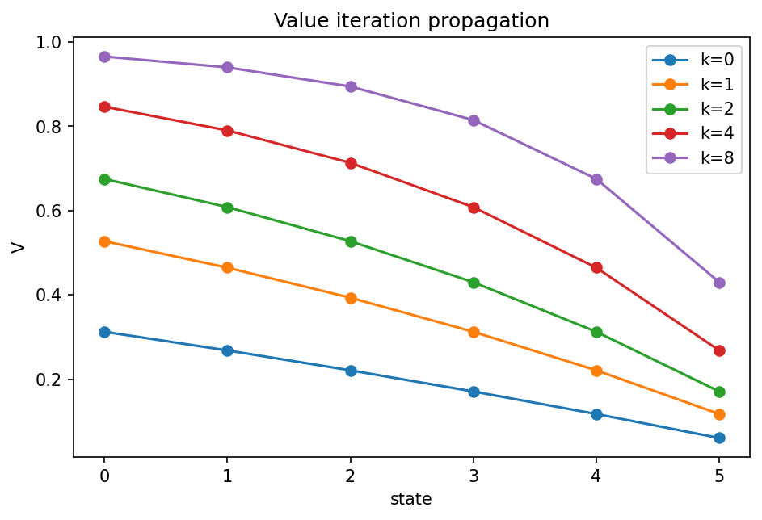
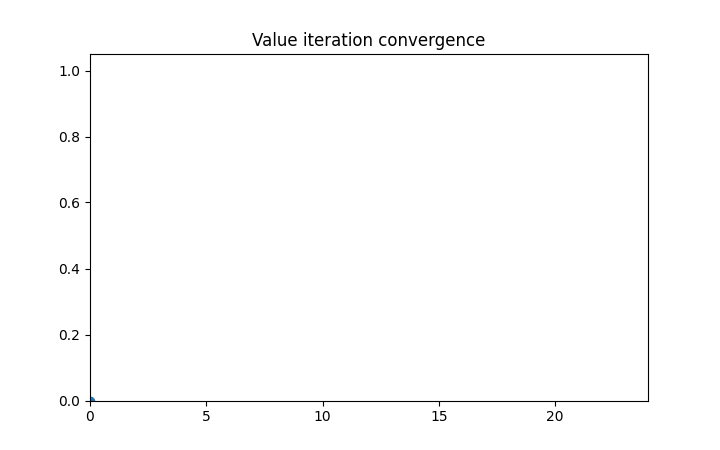

# value iterationとpolicy iteration

Course 08｜機械学習

---

## 今回の問い

modelが既知のMDPで、最適policyをBellman operatorの反復からどう求めるか。

---

## 直感

最適Bellman operatorは「1step行動を選び、その後も最適に行動する」backup。γ<1ならsup normでcontractionなので反復が一意の固定点V*へ収束する。

---

## 図解

---

## 動きで確認

---

## 中心式

$$
V_{k+1}(s)=\max_a\sum_{s\prime}P(s\prime|s,a)[r(s,a,s\prime)+\gamma V_k(s\prime)]
$$

---

## 導出

1. Bellman optimality equationを固定点方程式 V*=T*V* と読む。
2. T*はγ-contractionなので Banach fixed-point theoremにより反復収束。
3. V*から各状態でargmax actionを選んでgreedy optimal policyを得る。

---

## 小さい例

小さなgrid worldでterminalから価値が後方へ伝播する様子を反復で確認する。

---

## 条件を外すと

- policy evaluationとpolicy improvementを混同しない。
- γ=1のcontinuing taskで同じcontraction議論を無条件に使わない。

---

## 理解確認

- 式の各記号を定義できるか。
- 導出を1段ずつ再現できるか。
- 反例を1つ作れるか。

---

## 教科書と演習

[教科書](../../textbook/ml-dynamic-programming-value-policy-iteration)

[10問の演習](../../exercises/ml-dynamic-programming-value-policy-iteration)
