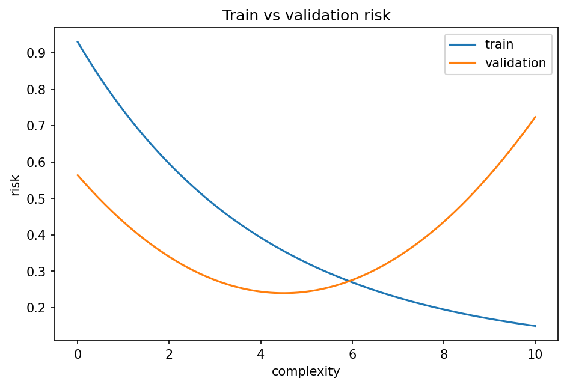

# 経験リスク・期待リスク・汎化

Course 08｜機械学習

---

## 今回の問い

training lossを下げることと、未知データで良い予測をすることはなぜ同じではないのか。

---

## 直感

学習で直接最小化できるのは有限標本の経験リスク。目的は母集団分布に対する期待リスクなので、両者のgapを理解するのがgeneralization。

---

## 図解

---

## 中心式

$$
R(f)=E_{(X,Y)\sim D}[\ell(f(X),Y)],\quad \hat R_n(f)=\frac1n\sum_{i=1}^n\ell(f(x_i),y_i)
$$

---

## 導出

1. 目標量Rは未知分布Dの期待値なので直接計算できない。
2. iid標本で期待値を標本平均R̂へ置き換える。
3. 同じデータでmodel選択まで行うと適応によるoptimismが生じるためvalidation/test分離が必要。

---

## 小さい例

高次数多項式はtraining errorを0にできてもtest errorが増える場合がある。

---

## 条件を外すと

- test setをhyperparameter tuningに使わない。
- training lossが低いだけで汎化を保証しない。

---

## 理解確認

- 式の各記号を定義できるか。
- 導出を1段ずつ再現できるか。
- 反例を1つ作れるか。

---

## 教科書と演習

[教科書](../../textbook/ml-empirical-risk-generalization)

[10問の演習](../../exercises/ml-empirical-risk-generalization)
