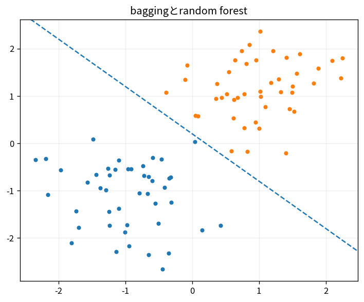

# baggingとrandom forest

Course 08｜機械学習｜Topic 08/20

---
layout: center
---

## 今回の問い

## 到達目標

- 定義と代表式を、自分の言葉と記号で説明できる。
- 成立条件を確認し、手計算と結果を検算できる。

## 理解確認

- 定義・条件・計算結果を自分の言葉で説明できるか確認する。

baggingとrandom forestの代表式は、どの定義・仮定から、なぜその形になるのか。

---

## なぜ今これを学ぶのか

前Topic `ml-decision-trees` で得た概念を使い、ここでは baggingとrandom forest へ進む。

---

## 直感

木モデルは特徴量のしきい値で入力空間を再帰的に分割し、ensembleは複数木のばらつきを平均化する。

---

## 図解

2次元空間の矩形分割を描く。 各分岐は1つの特徴量に対する条件、葉は最終予測である。木を深くするとtraining dataを細かく分けられる一方、varianceが上がる。

---

## 記号と代表式

- $f_b$：b番目base learner
- $B$：ensemble size
- $\hat f=B^{-1}\sum f_b$

$$
\hat{f}(\mathbf{x})=\frac{1}{B}\sum_{b=1}^{B}f_b(\mathbf{x})
$$

---

## 導出 1

同variance σ²、pair correlationρならaverage variance≈ρσ²+(1-ρ)σ²/B。

---

## 導出 2

independent partは1/Bへ減るがcorrelated componentは残る。

---

## 例題

correlation0ならB=100でvariance1/100。ρ=0.5ならlarge Bでも約0.5σ²が残る。

---

## 条件を変えるとどうなるか

同じdeterministic treeを100回コピーしてもvarianceは減らない。diversityが必要。

---

## よくある誤解

baggingとrandom forestでは、式へ数値を代入するだけでは不十分である。同じdeterministic treeを100回コピーしてもvarianceは減らない。diversityが必要。 という失敗例が示すように、式を使える条件と結論の範囲を区別する必要がある。

---

## 実装・計算上の注意

n_estimatorsはparallelizable。random seedとbootstrap/feature fraction記録。

---

## 一段先へ

平均ではなく前modelのmistake/residualへ次modelを逐次fitするboostingへ。

---

## 自分で説明できるか

- 「average variance」を式を見ずに説明できるか
- 「feature randomness」までの論理を一段ずつ再現できるか
- baggingとrandom forestの条件を1つ外した反例を説明できるか

---
layout: center
---

## 教科書と演習

- [教科書](../../textbook/ml-ensembles-bagging-random-forests)
- [10問の演習](../../exercises/ml-ensembles-bagging-random-forests)
