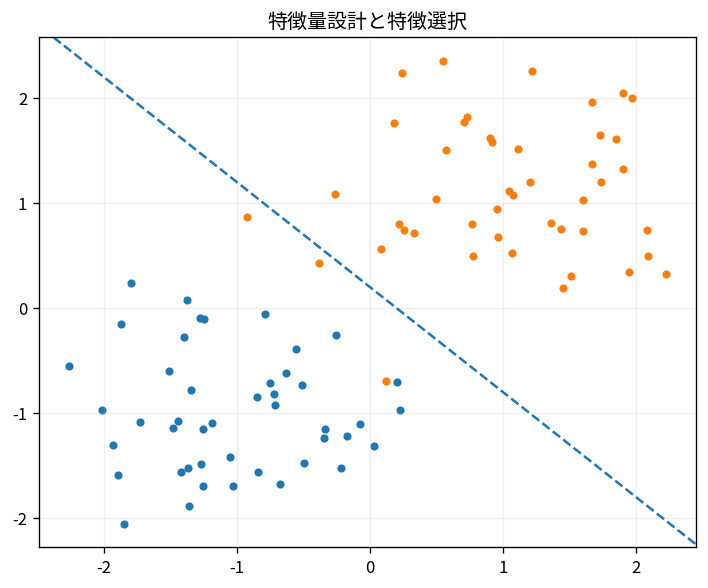

# 特徴量設計と特徴選択

Course 08｜機械学習

---
layout: center
---

## 今回の問い

特徴量設計と特徴選択で、何を入力し、代表式がどの量を出力し、どの成立条件を外すと結果が壊れるのか。

---

## 到達目標

- 特徴量設計と特徴選択の定義と代表式を言葉で説明できる
- 図と式の対応を説明できる
- 小さな例で成立条件と失敗条件を検算できる

---

## 直感

特徴量設計は生データから予測に必要な情報を抽出し、特徴選択は冗長・不要な次元を減らす。

**前提:** mat-data-matrices-centering-scaling, mat-ridge-lasso-elastic-net

---

## 図解

---

## 図を見るポイント

- 軸・node・矢印・領域が何を表すか確認する
- 代表式の各項と図の要素を対応づける
- 条件を変えたとき、どこが変化するか予測する

---

## 代表式

$$
\min_{\boldsymbol{\beta}}\mathcal{L}(\boldsymbol{\beta})+\lambda\|\boldsymbol{\beta}\|_1
$$

左辺の出力 → 右辺の操作 → 入力の型の順で読む。

---

## 式をどう読むか

- **対象:** 特徴量設計、特徴選択
- shape・次元・定義域を先に確定する
- 計算後に符号・大きさ・残差・確率などを図と照合する

---

## 小さな例

候補特徴の重要度と選択前後の性能を比較する。

最小の非自明な設定で、手計算と実装を照合する。

---

## 動き／思考実験で確認

- このTopicでは静止図を中心に条件を1つずつ変える思考実験を行う。
- 図の形がどう変わるか予測してから次へ進む。

---

## 成立条件

- 選択処理もcross-validationの内側で行う。
- 標的漏洩を避ける。
- 特徴量設計と特徴選択の定義と計算手順を区別し、数値例だけで一般性を判断しない。

---

## よくある誤解

- 特徴量設計と特徴選択の定義と計算手順を同一視する
- 成立条件を確認せず公式を適用する
- 数学上の次元と配列のshapeを混同する

---

## 数値・実装で検算

1. 小さい入力を作る
2. 定義式から期待値を手で求める
3. NumPy等の実装結果と比較する
4. shape・残差・許容誤差・seedを記録する

---

## 後続分野への接続

特徴量設計と特徴選択は、後続の数値計算・データ解析・機械学習で前提となる。

このTopicの量が、後続で入力・目的関数・制約・診断のどれとして使われるか確認する。

---

## まとめと演習

- 特徴量設計と特徴選択を図→式→小例の順で説明できるか
- 条件を1つ外した反例を作れるか

[教科書](../../textbook/ml-feature-engineering-selection)

[10問の演習](../../exercises/ml-feature-engineering-selection)
