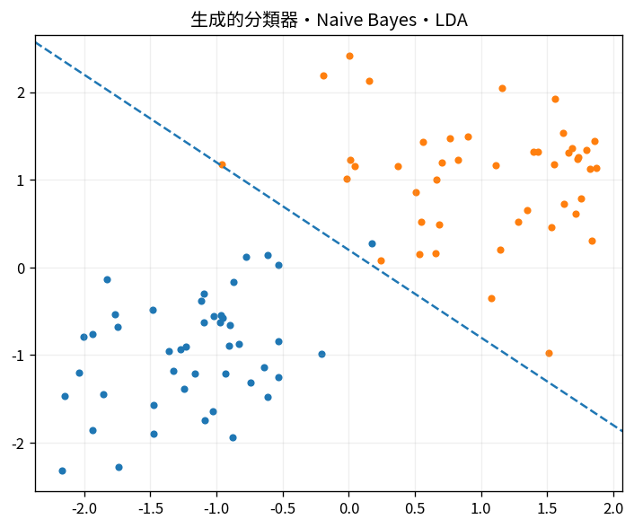

# 生成的分類器・Naive Bayes・LDA

Course 08｜機械学習｜Topic 05/20

---
layout: center
---

## 今回の問い

## 到達目標

- 定義と代表式を、自分の言葉と記号で説明できる。
- 成立条件を確認し、手計算と結果を検算できる。

## 理解確認

- 定義・条件・計算結果を自分の言葉で説明できるか確認する。

生成的分類器・Naive Bayes・LDAの代表式は、どの定義・仮定から、なぜその形になるのか。

---

## なぜ今これを学ぶのか

前Topic `ml-softmax-multiclass` で得た概念を使い、ここでは 生成的分類器・Naive Bayes・LDA へ進む。

---

## 直感

分類器は入力からクラス確率またはスコアを作り、決定境界でクラスを分ける。

---

## 図解

2クラス点群と確率等高線、decision boundaryを描く。 背景の確率面がP(y=1|x)、その0.5等高線がdecision boundary、点が観測データである。モデルの連続な確率出力と離散な最終分類を区別できる。

---

## 記号と代表式

- $p(x|y)$：class-conditional density
- $p(y)$：prior
- $p(y|x)\propto p(x|y)p(y)$

$$
p(y\mid\mathbf{x})\propto p(\mathbf{x}\mid y)p(y)
$$

---

## 導出 1

$argmax_y p(y|x)=argmax_y p(x|y)p(y)$ because p(x) common。

---

## 導出 2

conditional independence仮定で $p(x|y)=\prod_jp(x_j|y)$。高dim density estimationを1D factorsへ簡略化。

---

## 例題

text Naive Bayesでword occurrence likelihoodをclassごとに掛ける。log domainでsum。

---

## 条件を変えるとどうなるか

Naive independenceが大きく破れてもclassificationが使える場合はあるがprobability calibrationは悪化し得る。

---

## よくある誤解

生成的分類器・Naive Bayes・LDAでは、式へ数値を代入するだけでは不十分である。Naive independenceが大きく破れてもclassificationが使える場合はあるがprobability calibrationは悪化し得る。 という失敗例が示すように、式を使える条件と結論の範囲を区別する必要がある。

---

## 実装・計算上の注意

zero countにsmoothing。Gaussian covariance singularならregularization。

---

## 一段先へ

parametric distributionを置かず近傍dataから直接predictするkNNへ。

---

## 自分で説明できるか

- 「Bayes decision」を式を見ずに説明できるか
- 「LDA linear boundary」までの論理を一段ずつ再現できるか
- 生成的分類器・Naive Bayes・LDAの条件を1つ外した反例を説明できるか

---
layout: center
---

## 教科書と演習

- [教科書](../../textbook/ml-generative-classifiers-naive-bayes-lda)
- [10問の演習](../../exercises/ml-generative-classifiers-naive-bayes-lda)
