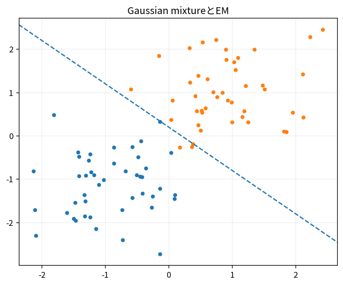

# Gaussian mixtureとEM

Course 08｜機械学習｜Topic 13/20

---
layout: center
---

## 今回の問い

## 到達目標

- 定義と代表式を、自分の言葉と記号で説明できる。
- 成立条件を確認し、手計算と結果を検算できる。

## 理解確認

- 定義・条件・計算結果を自分の言葉で説明できるか確認する。

Gaussian mixtureとEMの代表式は、どの定義・仮定から、なぜその形になるのか。

---

## なぜ今これを学ぶのか

前Topic `ml-clustering-kmeans-hierarchical` で得た概念を使い、ここでは Gaussian mixtureとEM へ進む。

---

## 直感

clusteringは正解ラベルなしで近い点を群へまとめる。距離と群の形状仮定が結果を決める。

---

## 図解

k-means中心が反復で動く様子を追う。 点群とクラスタ中心/密度成分を描く。教師ラベルではなく、距離や確率モデルが定める内部構造に基づいて割当てが更新される。

---

## 記号と代表式

- $\pi_k$：mixture weights
- $\mu_k,\Sigma_k$
- $\gamma_{ik}=P(z_i=k|x_i)$：responsibility

$$
p(\mathbf{x})=\sum_{k=1}^{K}\pi_k\mathcal{N}(\mathbf{x}\mid\boldsymbol{\mu}_k,\mathbf{\Sigma}_k)
$$

---

## 導出 1

$\log\sum_k\pi_kN(x|\mu_k,Σ_k)$ はparameterがsum内で直接maxしにくい。

---

## 導出 2

current parameterでBayes ruleからresponsibility γ_ikを計算。

---

## 例題

overlapping 2 Gaussiansでboundary pointはγ≈0.5となりsoft assignment。

---

## 条件を変えるとどうなるか

GMM likelihoodはcomponent covarianceを1 pointへcollapseさせるとunboundedになることがありregularization必要。

---

## よくある誤解

Gaussian mixtureとEMでは、式へ数値を代入するだけでは不十分である。GMM likelihoodはcomponent covarianceを1 pointへcollapseさせるとunboundedになることがありregularization必要。 という失敗例が示すように、式を使える条件と結論の範囲を区別する必要がある。

---

## 実装・計算上の注意

log-sum-exp、covariance floor、多initialization。label switching。

---

## 一段先へ

representation dimensionを下げるPCA/manifold methodsへ。

---

## 自分で説明できるか

- 「incomplete likelihoodのlog-sum」を式を見ずに説明できるか
- 「M-step」までの論理を一段ずつ再現できるか
- Gaussian mixtureとEMの条件を1つ外した反例を説明できるか

---
layout: center
---

## 教科書と演習

- [教科書](../../textbook/ml-gmm-em)
- [10問の演習](../../exercises/ml-gmm-em)
