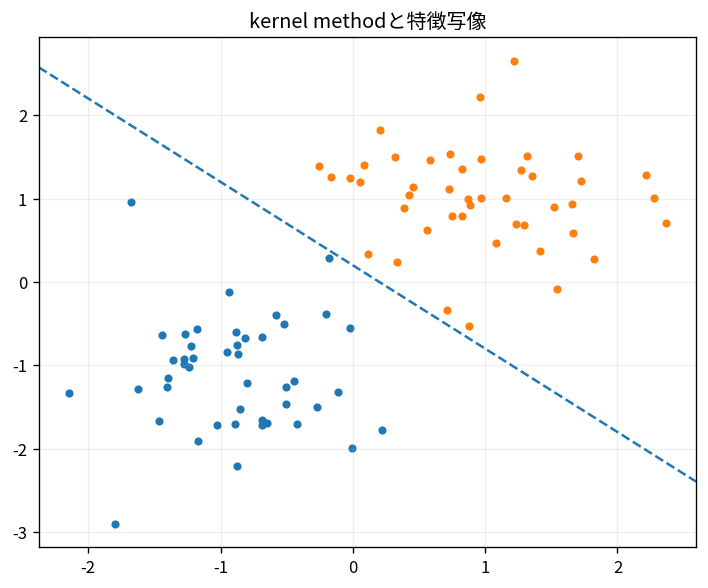

# kernel methodと特徴写像

Course 08｜機械学習｜Topic 11/20

---
layout: center
---

## 今回の問い

## 到達目標

- 定義と代表式を、自分の言葉と記号で説明できる。
- 成立条件を確認し、手計算と結果を検算できる。

## 理解確認

- 定義・条件・計算結果を自分の言葉で説明できるか確認する。

kernel methodと特徴写像の代表式は、どの定義・仮定から、なぜその形になるのか。

---

## なぜ今これを学ぶのか

前Topic `ml-svm-margin-kernels` で得た概念を使い、ここでは kernel methodと特徴写像 へ進む。

---

## 直感

kernel法は高次元特徴写像を明示せず内積だけ計算し、非線形境界を線形問題として扱う。

---

## 図解

元空間で非線形な点群が特徴空間で線形分離可能になる模式図を見る。 入力空間で曲がった境界も、類似度kernelを通じた高次元特徴空間では線形境界として表せる。実際の高次元座標を明示せず内積だけ計算する。

---

## 記号と代表式

- $\phi(x)$：possibly high-dimensional feature map
- $k(x,x^{\prime})=\langle\phi(x),\phi(x^{\prime})\rangle$
- $K$：Gram matrix

$$
k(\mathbf{x},\mathbf{x}^{\prime})=\langle\phi(\mathbf{x}),\phi(\mathbf{x}^{\prime})\rangle
$$

---

## 導出 1

many regularized linear problemsのsolutionはtraining features spanにあり $w=\sum_iα_i\phi(x_i)$。

---

## 導出 2

$w^T\phi(x)=\sum_iα_i\langle\phi(x_i),\phi(x)\rangle=\sum_iα_ik(x_i,x)$。

---

## 例題

polynomial kernel $(x^Tx^{\prime}+c)^2$ はdegree≤2 feature inner productに対応。

---

## 条件を変えるとどうなるか

arbitrary similarity functionはvalid kernelではない。GramがPSDでないとstandard convex kernel method性質が崩れる。

---

## よくある誤解

kernel methodと特徴写像では、式へ数値を代入するだけでは不十分である。arbitrary similarity functionはvalid kernelではない。GramがPSDでないとstandard convex kernel method性質が崩れる。 という失敗例が示すように、式を使える条件と結論の範囲を区別する必要がある。

---

## 実装・計算上の注意

kernel matrix memoryO(n²)がbottleneck。Nyström/random Fourier featuresでapproximate。

---

## 一段先へ

unsupervisedでcentroidを最適化するk-meansへ。

---

## 自分で説明できるか

- 「dual representation」を式を見ずに説明できるか
- 「kernel trick」までの論理を一段ずつ再現できるか
- kernel methodと特徴写像の条件を1つ外した反例を説明できるか

---
layout: center
---

## 教科書と演習

- [教科書](../../textbook/ml-kernel-methods-feature-maps)
- [10問の演習](../../exercises/ml-kernel-methods-feature-maps)
