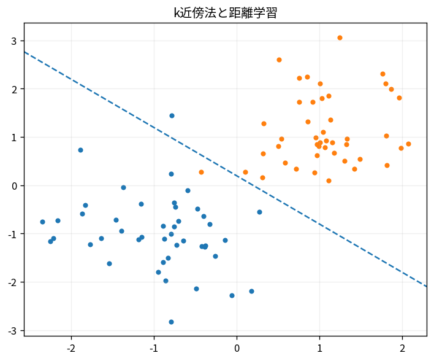

# k近傍法と距離学習

Course 08｜機械学習｜Topic 06/20

---
layout: center
---

## 今回の問い

## 到達目標

- 定義と代表式を、自分の言葉と記号で説明できる。
- 成立条件を確認し、手計算と結果を検算できる。

## 理解確認

- 定義・条件・計算結果を自分の言葉で説明できるか確認する。

k近傍法と距離学習の代表式は、どの定義・仮定から、なぜその形になるのか。

---

## なぜ今これを学ぶのか

前Topic `ml-generative-classifiers-naive-bayes-lda` で得た概念を使い、ここでは k近傍法と距離学習 へ進む。

---

## 直感

分類器は入力からクラス確率またはスコアを作り、決定境界でクラスを分ける。

---

## 図解

2クラス点群と確率等高線、decision boundaryを描く。 背景の確率面がP(y=1|x)、その0.5等高線がdecision boundary、点が観測データである。モデルの連続な確率出力と離散な最終分類を区別できる。

---

## 記号と代表式

- $\mathcal N_k(x)$：queryのk nearest training points
- $d(x,x_i)$：distance
- $k$：neighborhood size

$$
\hat{y}=\operatorname{mode}\{y_i:i\in\mathcal{N}_k(\mathbf{x})\}
$$

---

## 導出 1

近いxではconditional target distributionも似ると仮定。

---

## 導出 2

小kはlocalでlow bias/high variance、大kはsmoothでhigh bias/lower variance。

---

## 例題

k=1はtraining error0になりやすいがnoise labelへ敏感。k=15でboundary smooth化。

---

## 条件を変えるとどうなるか

test point scalingをtrainと別fitするとdistance spaceが不整合。

---

## よくある誤解

k近傍法と距離学習では、式へ数値を代入するだけでは不十分である。test point scalingをtrainと別fitするとdistance spaceが不整合。 という失敗例が示すように、式を使える条件と結論の範囲を区別する必要がある。

---

## 実装・計算上の注意

KD-treeは低dim向け、高dim approximate nearest neighbors。

---

## 一段先へ

distanceでなくfeature thresholdをrecursiveに分けるdecision treeへ。

---

## 自分で説明できるか

- 「locality assumption」を式を見ずに説明できるか
- 「distance scale」までの論理を一段ずつ再現できるか
- k近傍法と距離学習の条件を1つ外した反例を説明できるか

---
layout: center
---

## 教科書と演習

- [教科書](../../textbook/ml-knn-distance-methods)
- [10問の演習](../../exercises/ml-knn-distance-methods)
