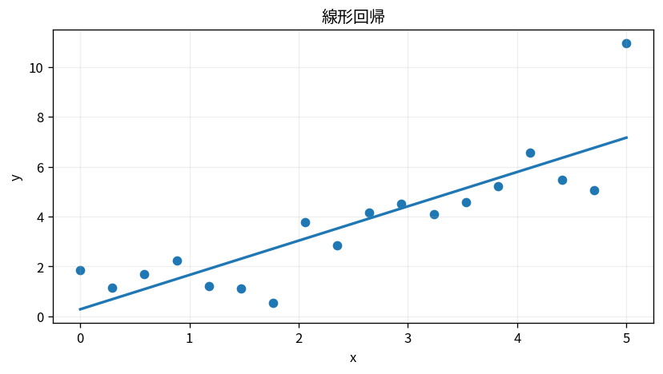

# 線形回帰

Course 08｜機械学習｜Topic 02/20

---
layout: center
---

## 今回の問い

## 到達目標

- 定義と代表式を、自分の言葉と記号で説明できる。
- 成立条件を確認し、手計算と結果を検算できる。

## 理解確認

- 定義・条件・計算結果を自分の言葉で説明できるか確認する。

線形回帰の代表式は、どの定義・仮定から、なぜその形になるのか。

---

## なぜ今これを学ぶのか

前Topic `ml-problem-formulation-data-splits` で得た概念を使い、ここでは 線形回帰 へ進む。

---

## 直感

回帰は入力から平均的な出力を説明・予測する関係をモデル化する。

---

## 図解

散布点、回帰線、残差を同時に描く。 点が観測値、線がモデル予測、点から線までの縦の差が残差である。二乗残差を合計する最小二乗では、大きな残差ほど強く目的関数へ効く。

---

## 記号と代表式

- $x\in\mathbb R^p$
- $\beta\in\mathbb R^p$
- $b$：intercept
- $\hat y=x^T\beta+b$

$$
\hat{y}=\mathbf{x}^{\mathsf T}\boldsymbol{\beta}+b
$$

---

## 導出 1

各feature contribution β_jx_jを足し、interceptでoriginをずらす。

---

## 導出 2

Gaussian noise MLEまたはEuclidean fitから $\sum(y_i-\hat y_i)^2$。

---

## 例題

house priceをarea, ageでfit。β_areaは他feature固定時のlinear marginal effect。

---

## 条件を変えるとどうなるか

extrapolationでlinear assumptionが壊れ、train range外で非現実的予測。

---

## よくある誤解

線形回帰では、式へ数値を代入するだけでは不十分である。extrapolationでlinear assumptionが壊れ、train range外で非現実的予測。 という失敗例が示すように、式を使える条件と結論の範囲を区別する必要がある。

---

## 実装・計算上の注意

pipeline内でscaling/feature transformをfit。metricsはMSE/MAE等目的に合わせる。

---

## 一段先へ

binary targetではlinear scoreを0〜1 probabilityへmapするlogistic regressionへ。

---

## 自分で説明できるか

- 「linear score」を式を見ずに説明できるか
- 「regularization/validation」までの論理を一段ずつ再現できるか
- 線形回帰の条件を1つ外した反例を説明できるか

---
layout: center
---

## 教科書と演習

- [教科書](../../textbook/ml-linear-regression)
- [10問の演習](../../exercises/ml-linear-regression)
