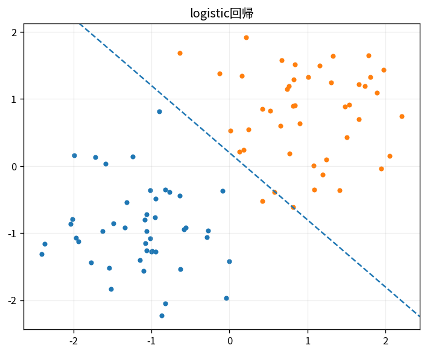

# logistic回帰

Course 08｜機械学習｜Topic 03/20

---
layout: center
---

## 今回の問い

logistic回帰の代表式は、どの定義・仮定から、なぜその形になるのか。

---

## なぜ今これを学ぶのか

前Topic `ml-linear-regression` で得た概念を使い、ここでは logistic回帰 へ進む。

---

## 直感

分類器は入力からクラス確率またはスコアを作り、決定境界でクラスを分ける。

---

## 図解

2クラス点群と確率等高線、decision boundaryを描く。 背景の確率面がP(y=1|x)、その0.5等高線がdecision boundary、点が観測データである。モデルの連続な確率出力と離散な最終分類を区別できる。

---

## 記号と代表式

- $z=x^Tw+b$
- $\sigma(z)=1/(1+e^{-z})$
- $p=P(Y=1|x)$

$$
p(y=1\mid\mathbf{x})=\sigma(\mathbf{x}^{\mathsf T}\mathbf{w}+b)
$$

---

## 導出 1

$p/(1-p)=e^z$ をpについて解くと $p=e^z/(1+e^z)=\sigma(z)$。

---

## 導出 2

Bernoulli likelihood $p^y(1-p)^{1-y}$ の-negative logはbinary cross entropy。

---

## 例題

z=ln3ならodds3:1、p=3/4。linear score差はprobability差として非線形に圧縮。

---

## 条件を変えるとどうなるか

sigmoid出力はmodel probabilityであり自動的にcalibratedではない。misspecification/regularizationでずれる。

---

## よくある誤解

logistic回帰では、式へ数値を代入するだけでは不十分である。sigmoid出力はmodel probabilityであり自動的にcalibratedではない。misspecification/regularizationでずれる。 という失敗例が示すように、式を使える条件と結論の範囲を区別する必要がある。

---

## 実装・計算上の注意

stable `logaddexp`/BCEWithLogitsを使いsigmoid後logを直接取らない。

---

## 一段先へ

binaryをK classesへ一般化するとsoftmax。

---

## 自分で説明できるか

- 「log-oddsからprobability」を式を見ずに説明できるか
- 「decision boundary」までの論理を一段ずつ再現できるか
- logistic回帰の条件を1つ外した反例を説明できるか

---
layout: center
---

## 教科書と演習

- [教科書](../../textbook/ml-logistic-regression)
- [10問の演習](../../exercises/ml-logistic-regression)
