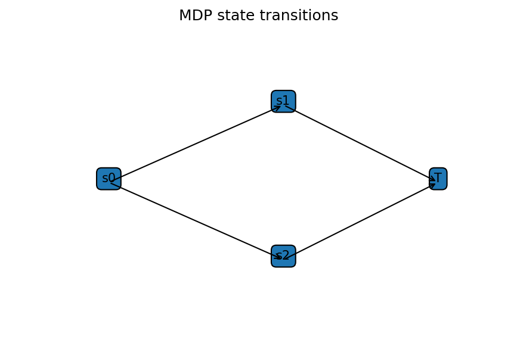

# MDPとBellman方程式

Course 08｜機械学習

---

## 今回の問い

逐次意思決定を、状態・行動・報酬・遷移の確率modelとしてどう定式化するか。

---

## 直感

MDPは現在状態が与えられれば未来の遷移分布が過去全体に依存しないMarkov性を仮定する。価値関数は将来報酬の割引和の期待値。

---

## 図解

---

## 中心式

$$
V^\pi(s)=E_\pi[R_{t+1}+\gamma V^\pi(S_{t+1})\mid S_t=s]
$$

---

## 導出

1. return $G_t=R_{t+1}+γR_{t+2}+…$ を定義する。
2. 先頭1stepを分離して $G_t=R_{t+1}+γG_{t+1}$。
3. 状態sで条件付き期待値を取るとBellman expectation equation。

---

## 小さい例

2状態MDPで遷移確率と報酬を与えれば、Vπは連立一次方程式として解ける。

---

## 条件を外すと

- rewardとvalueを同じ量と思わない。
- discount γ の位置を1stepずらさない。

---

## 理解確認

- 式の各記号を定義できるか。
- 導出を1段ずつ再現できるか。
- 反例を1つ作れるか。

---

## 教科書と演習

[教科書](../../textbook/ml-mdp-bellman-equations)

[10問の演習](../../exercises/ml-mdp-bellman-equations)
