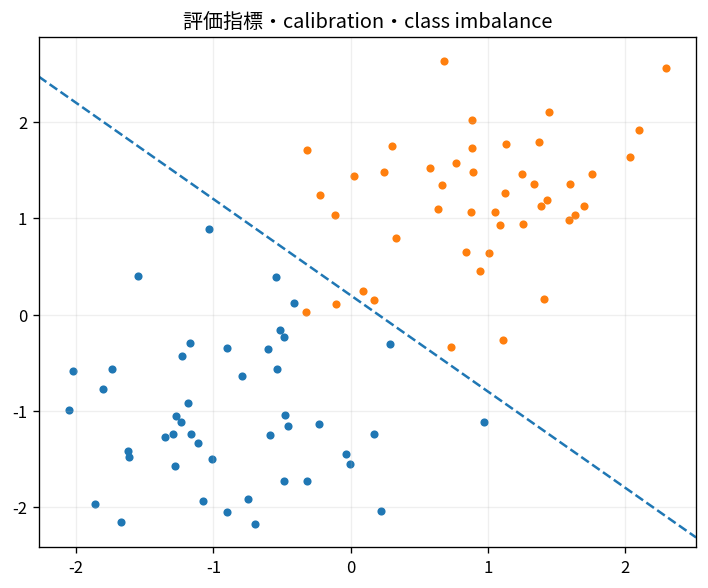

# 評価指標・calibration・class imbalance

Course 08｜機械学習｜Topic 19/20

---
layout: center
---

## 今回の問い

## 到達目標

- 定義と代表式を、自分の言葉と記号で説明できる。
- 成立条件を確認し、手計算と結果を検算できる。

## 理解確認

- 定義・条件・計算結果を自分の言葉で説明できるか確認する。

評価指標・calibration・class imbalanceの代表式は、どの定義・仮定から、なぜその形になるのか。

---

## なぜ今これを学ぶのか

前Topic `ml-model-selection-cross-validation` で得た概念を使い、ここでは 評価指標・calibration・class imbalance へ進む。

---

## 直感

calibrationは予測確率0.8の集合で実際に約80%当たるかを確認する。

---

## 図解

reliability diagramと理想対角線を描く。 予測確率を横軸、実際の陽性率を縦軸に置き、対角線に近いほど確率の意味が校正されている。accuracyが高くてもcalibrationが良いとは限らない。

---

## 記号と代表式

- $TP,FP,FN,TN$
- $Precision=TP/(TP+FP)$
- $Recall=TP/(TP+FN)$
- $p(x)$：predicted probability

$$
\operatorname{Precision}=\frac{TP}{TP+FP}
$$

---

## 導出 1

thresholdでprobabilityをhard labelへすると4 counts。

---

## 導出 2

false positive数はnegative population sizeに依存するためsame TPR/FPRでもprevalenceでprecision変化。

---

## 例題

rare disease prevalence1%ではFPR5%でもfalse positivesが多数になりprecision低くなり得る。

---

## 条件を変えるとどうなるか

accuracy99%はprevalence99%でall-negative predictorでも達成し得る。

---

## よくある誤解

評価指標・calibration・class imbalanceでは、式へ数値を代入するだけでは不十分である。accuracy99%はprevalence99%でall-negative predictorでも達成し得る。 という失敗例が示すように、式を使える条件と結論の範囲を区別する必要がある。

---

## 実装・計算上の注意

PR-AUC/ROC-AUC、macro/micro、thresholdはbusiness costと共に。calibrationはheld-out data。

---

## 一段先へ

deployment後はuncertainty, explanation, drift monitoringを統合する。

---

## 自分で説明できるか

- 「confusion counts」を式を見ずに説明できるか
- 「calibration」までの論理を一段ずつ再現できるか
- 評価指標・calibration・class imbalanceの条件を1つ外した反例を説明できるか

---
layout: center
---

## 教科書と演習

- [教科書](../../textbook/ml-metrics-calibration-imbalance)
- [10問の演習](../../exercises/ml-metrics-calibration-imbalance)
