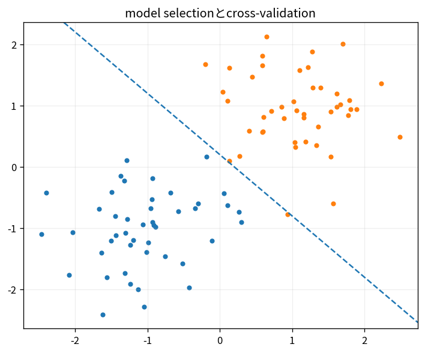

# model selectionとcross-validation

Course 08｜機械学習｜Topic 18/20

---
layout: center
---

## 今回の問い

## 到達目標

- 定義と代表式を、自分の言葉と記号で説明できる。
- 成立条件を確認し、手計算と結果を検算できる。

## 理解確認

- 定義・条件・計算結果を自分の言葉で説明できるか確認する。

model selectionとcross-validationの代表式は、どの定義・仮定から、なぜその形になるのか。

---

## なぜ今これを学ぶのか

前Topic `ml-bias-variance-regularization` で得た概念を使い、ここでは model selectionとcross-validation へ進む。

---

## 直感

cross-validationはデータ分割を入れ替えて汎化性能の推定を安定化する。

---

## 図解

K-foldの矩形ブロックを順番にvalidationへ回す。 データをfoldごとにtrain/validation役へ交代させ、各foldの評価を平均する。同じ標本を学習と評価へ同時に使わない構造が重要である。

---

## 記号と代表式

- $K$：fold数
- $R_k$：k fold validation risk
- $\widehat R_{CV}=K^{-1}\sum R_k$

$$
\widehat{R}_{\mathrm{CV}}=\frac{1}{K}\sum_{k=1}^{K}R_k
$$

---

## 導出 1

各sampleはvalidation時、そのfoldのfitに使われない。

---

## 導出 2

fold riskを平均してfinite-data performance estimate。

---

## 例題

5-foldでpreprocessingも各train fold内fit。

---

## 条件を変えるとどうなるか

feature selectionをCVの外で全dataに実行してからCVするとoptimistic leakage。

---

## よくある誤解

model selectionとcross-validationでは、式へ数値を代入するだけでは不十分である。feature selectionをCVの外で全dataに実行してからCVするとoptimistic leakage。 という失敗例が示すように、式を使える条件と結論の範囲を区別する必要がある。

---

## 実装・計算上の注意

group/stratified split、metric aggregation、confidence/variance報告。

---

## 一段先へ

model選択後、taskに合うmetric・threshold・calibrationを設計する。

---

## 自分で説明できるか

- 「reuse without same-sample evaluation」を式を見ずに説明できるか
- 「nested need」までの論理を一段ずつ再現できるか
- model selectionとcross-validationの条件を1つ外した反例を説明できるか

---
layout: center
---

## 教科書と演習

- [教科書](../../textbook/ml-model-selection-cross-validation)
- [10問の演習](../../exercises/ml-model-selection-cross-validation)
