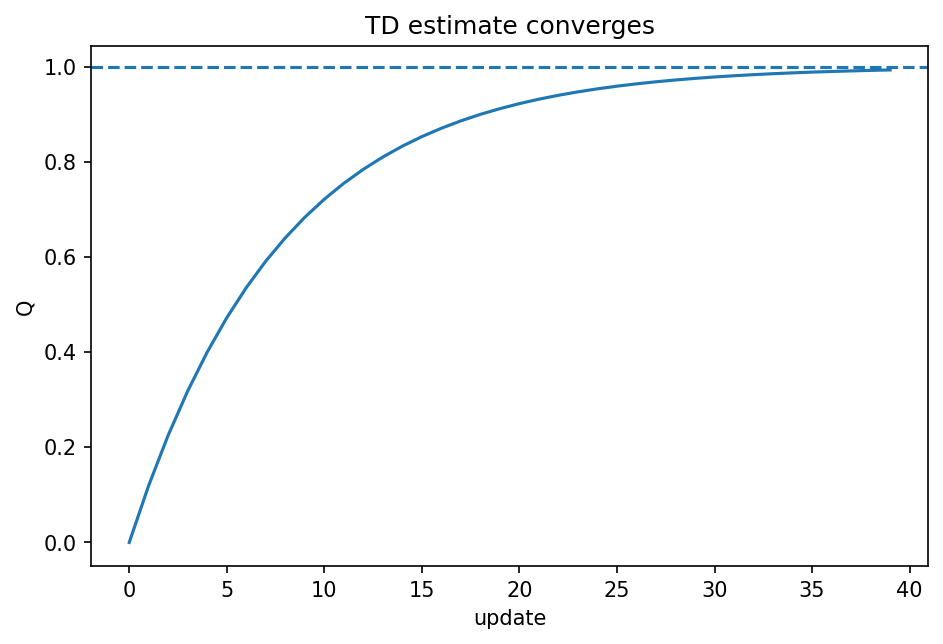

# Monte Carlo・TD・Q-learning

Course 08｜機械学習

---

## 何を解決するか

遷移modelが未知でも、経験sampleだけから価値関数をどう学ぶか。

Monte Carloはepisode完了後の実returnをtargetにする。TDは1step先の現在推定値をbootstrapping targetにする。Q-learningはoff-policy TD control。

---

## 図の意味

横軸がupdate回数、縦軸がQ推定値。破線がBellman targetに対応する真の値で、sampleに基づくupdateが揺れながら近づく。terminal報酬が直前state-actionから前方へ徐々に伝わるというbootstrappingの特徴を表す。

---

## 記号

| 記号 | 意味 |
|---|---|
| $α$ | learning rate |
| $δ_t$ | TD error |
| $Q(s,a)$ | action value |

- $Q(s,a)$：state-action value推定。
- $\alpha$：learning rate。
- $R_{t+1}+\gamma\max_aQ(S_{t+1},a)$：1step TD target。

---

## 中心式

$$
Q(S_t,A_t)\leftarrow Q(S_t,A_t)+\alpha[R_{t+1}+\gamma\max_aQ(S_{t+1},a)-Q(S_t,A_t)]
$$

---

## 導出

1. Bellman optimality targetを未知期待値のsampleで近似する。
2. 現在Qとsample targetとの差をTD errorとする。
3. stochastic approximationとしてQをTD error方向へ更新する。

---

## 省略しない一段

Monte Carloはepisode終了後に実現return $G_t$ をtargetにするのでunbiasedに近いがvarianceが大きく、途中更新できない。TD(0)は $R_{t+1}+\gamma V(S_{t+1})$ をtargetにして現在推定を一部使うbootstrap。

Q-learningではoptimal Bellman target $Y_t=R_{t+1}+\gamma\max_aQ(S_{t+1},a)$ をsample 1本で作り、$Q\leftarrow Q+\alpha(Y-Q)$。behavior policyが探索を続け適切なstep size条件などが満たされるtabular settingでoptimal Qへ収束する。

---

## 手計算

**問題**：$Q(s,a)=1.5$, reward2, $\gamma=0.8$, 次stateのmaxQ=3, $\alpha=0.25$。Q-learning 1step後のQを求めよ。

**解答**：target=$2+0.8\times3=4.4$。TD error=4.4-1.5=2.9。update=$1.5+0.25\times2.9=2.225$。

---

## 条件を変える

$Q(s,a)=2$, reward=1, $\gamma=0.9$, 次stateのmaxQ=4, $\alpha=0.5$。target=4.6、TD error=2.6、新Q=2+0.5*2.6=3.3。

---

## どこで壊れるか

Q-learningがoff-policyだから探索不要という意味ではない。未訪問actionの価値は学べない。function approximationとbootstrappingとoff-policyを組み合わせると不安定化する「deadly triad」にも注意。

---

## 次へ

Deep Q-NetworkはQ tableをneural networkへ置き換え、replay bufferとtarget networkで不安定性を緩和する。

---

[教科書](../../textbook/ml-monte-carlo-td-q-learning)　|　[10問の演習](../../exercises/ml-monte-carlo-td-q-learning)

---

## 今回の問い

「Monte Carlo・TD・Q-learning」は何を表し、どの条件で使え、結果をどう検算するのか？

---

## 到達目標

- 遷移modelが未知でも、経験sampleだけから価値関数をどう学ぶか。
- 中心式の記号と成立条件を説明できる
- 小さい例と反例で検算できる

---

## 理解確認

1. 遷移modelが未知でも、経験sampleだけから価値関数をどう学ぶか。
2. 中心式の記号と成立条件を説明できる
3. 小さい例と反例で検算できる
