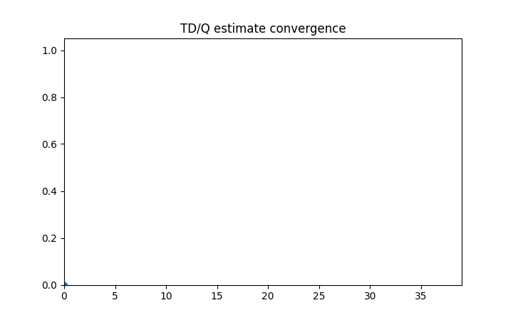

# Monte Carlo・TD・Q-learning

Course 08｜機械学習

---

## 今回の問い

遷移modelが未知でも、経験sampleだけから価値関数をどう学ぶか。

---

## 直感

Monte Carloはepisode完了後の実returnをtargetにする。TDは1step先の現在推定値をbootstrapping targetにする。Q-learningはoff-policy TD control。

---

## 図解

---

## 動きで確認

---

## 中心式

$$
Q(S_t,A_t)\leftarrow Q(S_t,A_t)+\alpha[R_{t+1}+\gamma\max_aQ(S_{t+1},a)-Q(S_t,A_t)]
$$

---

## 導出

1. Bellman optimality targetを未知期待値のsampleで近似する。
2. 現在Qとsample targetとの差をTD errorとする。
3. stochastic approximationとしてQをTD error方向へ更新する。

---

## 小さい例

terminal直前の成功報酬がまず直前state-actionへ入り、episodeを重ねると前の状態へ伝播する。

---

## 条件を外すと

- Q-learningのmax targetとSARSAのon-policy next actionを混同しない。
- function approximation + off-policy + bootstrappingの不安定性に注意する。

---

## 理解確認

- 式の各記号を定義できるか。
- 導出を1段ずつ再現できるか。
- 反例を1つ作れるか。

---

## 教科書と演習

[教科書](../../textbook/ml-monte-carlo-td-q-learning)

[10問の演習](../../exercises/ml-monte-carlo-td-q-learning)
