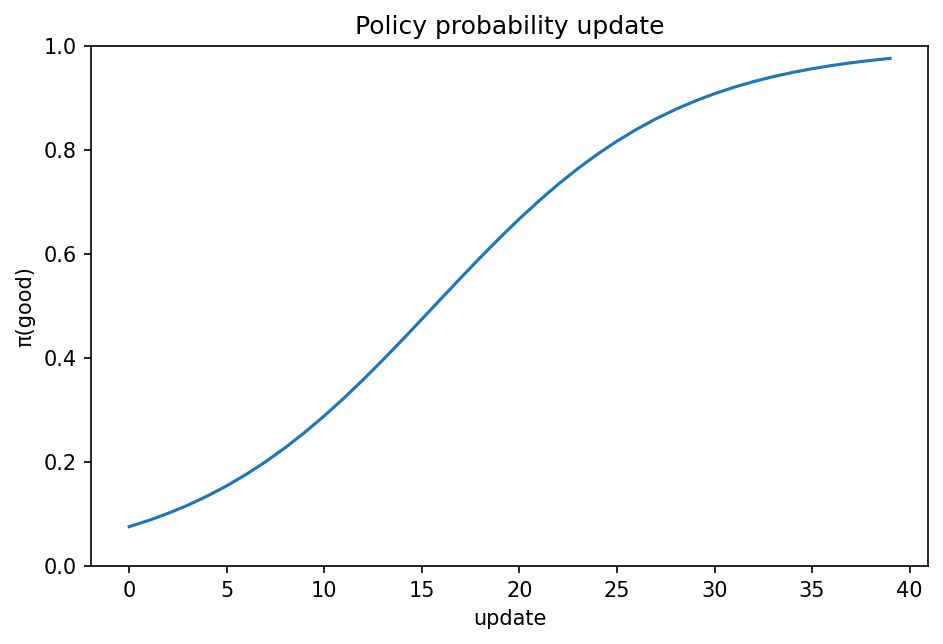

# policy gradientとREINFORCE

Course 08｜機械学習

---

## 何を解決するか

価値のargmaxを介さず、確率policyそのものを期待returnが増える方向へどう更新するか。

trajectory確率のlog微分を使うと、環境遷移を微分せずに期待returnのgradientをpolicyのlog-probabilityで表せる。

---

## 図の意味

横軸が学習update、縦軸が良いactionのpolicy probability。returnの高いtrajectoryに含まれたactionのlog-probabilityをgradientで上げると、確率が徐々に1へ寄る。価値関数のargmaxを介さず、確率分布そのものを動かす。

---

## 記号

| 記号 | 意味 |
|---|---|
| $π_θ(a|s)$ | parameter θ のpolicy |
| $τ$ | trajectory |
| $G_t$ | return |
| $J(θ)$ | 期待return |

- $\theta$：policy parameter。
- $J(\theta)$：expected return objective。
- $G_t$：時刻t以降のreturn。
- $\nabla\log\pi_\theta(A_t|S_t)$：score function。

---

## 中心式

$$
\nabla_\theta J(\theta)=E_\pi\left[\sum_t G_t\nabla_\theta\log\pi_\theta(A_t|S_t)\right]
$$

---

## 導出

1. $J=E_{τ\sim p_θ}[R(τ)]$ を積分/和で書く。
2. $\nabla p_θ=p_θ\nabla\log p_θ$ のlog-derivative trickを使う。
3. 環境transitionはθに依存しないのでtrajectory log-probabilityのgradientはpolicy log-probabilityの和だけ残る。

---

## 省略しない一段

trajectory $\tau=(s_0,a_0,\dots)$ の確率は初期分布・環境transition・policy確率の積。環境transitionがparameter $\theta$ に依存しないとき、$\nabla_\theta\log p_\theta(\tau)=\sum_t\nabla\log\pi_\theta(a_t|s_t)$。

$J=\sum_\tau p_\theta(\tau)R(\tau)$ を微分し、$\nabla p=p\nabla\log p$ を使うとpolicy gradient estimatorが得られる。baseline $b(s_t)$ はactionに依存しなければ期待gradientを変えず、varianceを減らせる。

---

## 手計算

**問題**：2-action softmax policyでlogitが $(0,0)$。action1を選びadvantage=2を得た。$\nabla_{z_1}\log\pi(a_1)=1-\pi(a_1)$ を使い、logit1に対するgradient contributionを求めよ。

**解答**：$\pi(a_1)=0.5$ なので derivative=0.5。advantage2を掛けてgradient contribution=1。gradient ascentならz1を増やす方向。

---

## 条件を変える

2 action softmaxで現在 $\pi(a_1)=0.5$。あるepisodeでa1を選び正のadvantageを得たなら $\nabla\log\pi(a_1)$ 方向へparameterを更新し、a1のlogitを相対的に上げる。

---

## どこで壊れるか

returnを大きくしたactionを無条件に上げるだけでは、stateごとの差やbaselineを無視して高varianceになる。REINFORCEはunbiasedでもsample efficiencyが低い。

---

## 次へ

actor–criticはcriticでadvantageを推定しvarianceを下げる。PPOはpolicy更新幅を制限し、Course10のRLHFでLLM policyを更新する中心手法の一つになる。

---

[教科書](../../textbook/ml-policy-gradient-reinforce)　|　[10問の演習](../../exercises/ml-policy-gradient-reinforce)

---

## 今回の問い

「policy gradientとREINFORCE」は何を表し、どの条件で使え、結果をどう検算するのか？

---

## 到達目標

- 価値のargmaxを介さず、確率policyそのものを期待returnが増える方向へどう更新するか。
- 中心式の記号と成立条件を説明できる
- 小さい例と反例で検算できる

---

## 理解確認

1. 価値のargmaxを介さず、確率policyそのものを期待returnが増える方向へどう更新するか。
2. 中心式の記号と成立条件を説明できる
3. 小さい例と反例で検算できる
