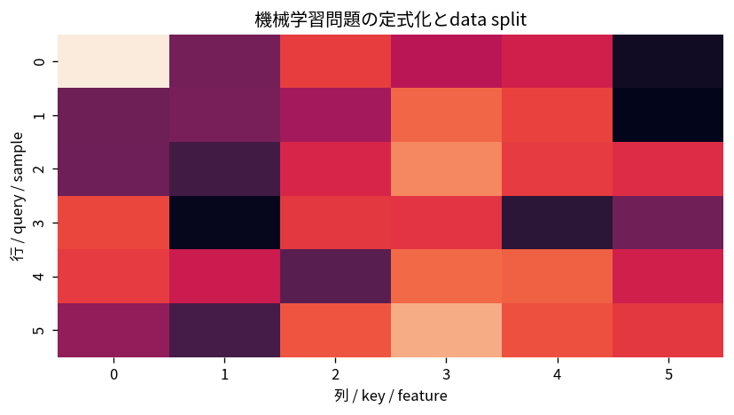

# 機械学習問題の定式化とdata split

Course 08｜機械学習｜Topic 01/20

---
layout: center
---

## 今回の問い

## 到達目標

- 定義と代表式を、自分の言葉と記号で説明できる。
- 成立条件を確認し、手計算と結果を検算できる。

## 理解確認

- 定義・条件・計算結果を自分の言葉で説明できるか確認する。

機械学習問題の定式化とdata splitの代表式は、どの定義・仮定から、なぜその形になるのか。

---

## なぜ今これを学ぶのか

Course 08 の入口として、機械学習問題の定式化とdata split を定義から組み立てる。

---

## 直感

data splitは学習・選択・最終評価の役割を分離し、同じデータを見て性能を過大評価するのを防ぐ。

---

## 図解

データ列をtrain/validation/testへ分割し、情報の流れを矢印で示す。 trainはパラメータ学習、validationは選択、testは最後の性能推定にだけ流れる。testからtrain側へ矢印が戻ると情報漏洩になり、最終評価が楽観的になる。

---

## 記号と代表式

- $\mathcal D_{train}$：parameter fit用
- $\mathcal D_{val}$：hyperparameter/model selection用
- $\mathcal D_{test}$：最終評価用
- $R(f)=E[\ell(f(X),Y)]$：population risk

$$
\mathcal{D}=\mathcal{D}_{\mathrm{train}}\cup\mathcal{D}_{\mathrm{val}}\cup\mathcal{D}_{\mathrm{test}}
$$

---

## 導出 1

train dataでpopulation expectationを直接計算できないので $\hat R_{train}=n^{-1}\sum\ell$ をminimizeする。

---

## 導出 2

train performanceでhyperparameterを選ぶとtraining noiseへ適応する。独立validationでchoiceを評価する。

---

## 例題

20 candidate modelsからvalidationで選び、testは最後に一度だけreport。

---

## 条件を変えるとどうなるか

標準化meanを全dataでfitしてからsplitするとtest情報がtrain featuresへ漏れる。

---

## よくある誤解

機械学習問題の定式化とdata splitでは、式へ数値を代入するだけでは不十分である。標準化meanを全dataでfitしてからsplitするとtest情報がtrain featuresへ漏れる。 という失敗例が示すように、式を使える条件と結論の範囲を区別する必要がある。

---

## 実装・計算上の注意

split seed、stratification、group/time rules、preprocessing fit scopeをpipelineで固定。

---

## 一段先へ

まず最も単純なsupervised predictorとしてlinear regressionをpredictionの観点から再構成する。

---

## 自分で説明できるか

- 「経験risk」を式を見ずに説明できるか
- 「testの役割」までの論理を一段ずつ再現できるか
- 機械学習問題の定式化とdata splitの条件を1つ外した反例を説明できるか

---
layout: center
---

## 教科書と演習

- [教科書](../../textbook/ml-problem-formulation-data-splits)
- [10問の演習](../../exercises/ml-problem-formulation-data-splits)
