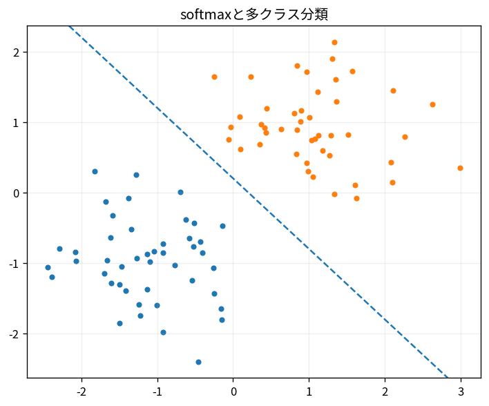

# softmaxと多クラス分類

Course 08｜機械学習｜Topic 04/20

---
layout: center
---

## 今回の問い

## 到達目標

- 定義と代表式を、自分の言葉と記号で説明できる。
- 成立条件を確認し、手計算と結果を検算できる。

## 理解確認

- 定義・条件・計算結果を自分の言葉で説明できるか確認する。

softmaxと多クラス分類の代表式は、どの定義・仮定から、なぜその形になるのか。

---

## なぜ今これを学ぶのか

前Topic `ml-logistic-regression` で得た概念を使い、ここでは softmaxと多クラス分類 へ進む。

---

## 直感

分類器は入力からクラス確率またはスコアを作り、決定境界でクラスを分ける。

---

## 図解

2クラス点群と確率等高線、decision boundaryを描く。 背景の確率面がP(y=1|x)、その0.5等高線がdecision boundary、点が観測データである。モデルの連続な確率出力と離散な最終分類を区別できる。

---

## 記号と代表式

- $z_k$：class k logit
- $K$：class数
- $p_k=e^{z_k}/\sum_j e^{z_j}$

$$
p(y=k\mid\mathbf{x})=\frac{e^{z_k}}{\sum_j e^{z_j}}
$$

---

## 導出 1

exp(z_k)>0でclass scoreをpositive化。

---

## 導出 2

全scoreのsumで割りsum_k p_k=1。

---

## 例題

logits(0,0,0)→各1/3。logits(2,0,0)ではclass1 probability e²/(e²+2)。

---

## 条件を変えるとどうなるか

argmax classだけ見ればconfidence/calibration情報を失う。

---

## よくある誤解

softmaxと多クラス分類では、式へ数値を代入するだけでは不十分である。argmax classだけ見ればconfidence/calibration情報を失う。 という失敗例が示すように、式を使える条件と結論の範囲を区別する必要がある。

---

## 実装・計算上の注意

log-sum-exp trick、mask、label smoothing convention確認。

---

## 一段先へ

Bayes ruleでclass-conditional modelからposteriorを作るgenerative classifierへ。

---

## 自分で説明できるか

- 「positive score」を式を見ずに説明できるか
- 「cross entropy gradient」までの論理を一段ずつ再現できるか
- softmaxと多クラス分類の条件を1つ外した反例を説明できるか

---
layout: center
---

## 教科書と演習

- [教科書](../../textbook/ml-softmax-multiclass)
- [10問の演習](../../exercises/ml-softmax-multiclass)
