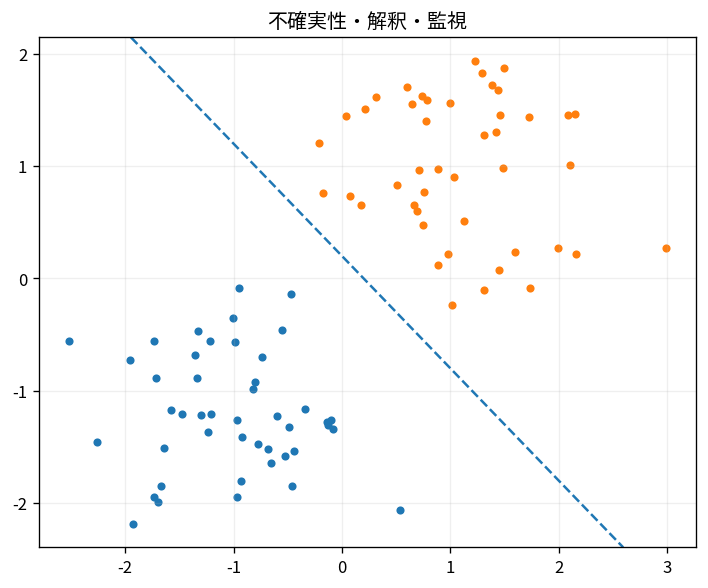

# 不確実性・解釈・監視

Course 08｜機械学習｜Topic 20/20

---
layout: center
---

## 今回の問い

## 到達目標

- 定義と代表式を、自分の言葉と記号で説明できる。
- 成立条件を確認し、手計算と結果を検算できる。

## 理解確認

- 定義・条件・計算結果を自分の言葉で説明できるか確認する。

不確実性・解釈・監視の代表式は、どの定義・仮定から、なぜその形になるのか。

---

## なぜ今これを学ぶのか

前Topic `ml-metrics-calibration-imbalance` で得た概念を使い、ここでは 不確実性・解釈・監視 へ進む。

---

## 直感

運用では予測精度だけでなく、入力分布、確信度、失敗例、時間変化を監視する。

---

## 図解

時間に沿うfeature driftとerror rateを並べる。 学習時と運用時の分布を重ね、入力・予測・性能指標のどこが変わったかを追う。distribution shift検知と性能劣化確認は別の問題である。

---

## 記号と代表式

- $\hat p$：predictive confidence
- $ECE$：calibration error proxy
- $P_{train},P_{deploy}$：distributions
- $drift$：distribution change

$$
\operatorname{ECE}=\sum_b\frac{|B_b|}{n}|\operatorname{acc}(B_b)-\operatorname{conf}(B_b)|
$$

---

## 導出 1

aleatoric noiseとepistemic/model uncertaintyを概念上分ける。confidence score=真のuncertaintyとは限らない。

---

## 導出 2

feature attributionはmodel behavior説明であり因果効果とは限らない。global/localを区別。

---

## 例題

camera sensor changeでinput brightness distribution drift。accuracy label遅延前にfeature driftを検知できる。

---

## 条件を変えるとどうなるか

SHAP importanceが高いfeatureを「原因」と断定するのは誤り。model association explanation。

---

## よくある誤解

不確実性・解釈・監視では、式へ数値を代入するだけでは不十分である。SHAP importanceが高いfeatureを「原因」と断定するのは誤り。model association explanation。 という失敗例が示すように、式を使える条件と結論の範囲を区別する必要がある。

---

## 実装・計算上の注意

logging schema、privacy、label delay、alert false positivesを設計。model/data/version lineage。

---

## 一段先へ

Course09ではmodel classをdeep networksへ拡張するが、split/metric/calibration/monitoring原則はそのまま必要。

---

## 自分で説明できるか

- 「uncertainty source分離」を式を見ずに説明できるか
- 「monitor loop」までの論理を一段ずつ再現できるか
- 不確実性・解釈・監視の条件を1つ外した反例を説明できるか

---
layout: center
---

## 教科書と演習

- [教科書](../../textbook/ml-uncertainty-interpretability-monitoring)
- [10問の演習](../../exercises/ml-uncertainty-interpretability-monitoring)
