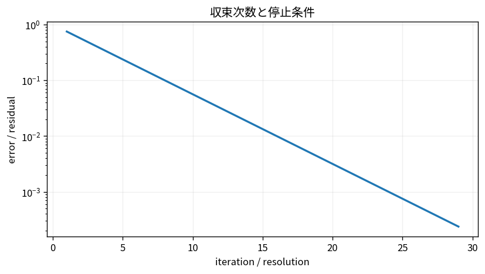

# 収束次数と停止条件

Course 05｜数値計算｜Topic 03/20

---
layout: center
---

## 今回の問い

## 到達目標

- 定義と代表式を、自分の言葉と記号で説明できる。
- 成立条件を確認し、手計算と結果を検算できる。

## 理解確認

- 定義・条件・計算結果を自分の言葉で説明できるか確認する。

収束次数と停止条件の代表式は、どの定義・仮定から、なぜその形になるのか。

---

## なぜ今これを学ぶのか

前Topic `num-errors-conditioning-stability` で得た概念を使い、ここでは 収束次数と停止条件 へ進む。

---

## 直感

反復法では誤差e_kが何乗の速さで小さくなるかと、どこで止めるかを分けて考える。

---

## 図解

線形収束・二次収束の誤差曲線を比較する。 横軸が反復回数、縦軸が誤差である。直線的な減少と急激な減少の違いは、誤差更新式e_{k+1}≈C e_k^pの指数pの違いに対応する。

---

## 記号と代表式

- $x^*$：真の解
- $e_k=x_k-x^*$：k反復目の誤差
- $p$：収束次数
- $C$：漸近誤差定数
- $r_k$：計算可能な残差

$$
|e_{k+1}|\le C|e_k|^p
$$

---

## 導出 1

反復 $x_{k+1}=G(x_k)$ を解x*の周りでTaylor展開。$e_{k+1}=G(x*+e_k)-G(x*)\approx G^{\prime}(x*)e_k+\frac12G^{\prime\prime}(x*)e_k^2+\cdots$。

---

## 導出 2

$G^{\prime}(x*)\ne0$ なら線形項支配でp=1。$G^{\prime}(x*)=0$ かつ二階項非zeroならp=2。

---

## 例題

誤差が毎回0.2倍なら線形収束。誤差 $10^{-2}\to10^{-4}\to10^{-8}$ のようにほぼ二乗されるなら二次収束。

---

## 条件を変えるとどうなるか

iterate差が小さいだけで解に近いとは限らない。step sizeを極端に小さくしたgradient methodはほぼ動かないが未収束の場合がある。

---

## よくある誤解

収束次数と停止条件では、式へ数値を代入するだけでは不十分である。iterate差が小さいだけで解に近いとは限らない。step sizeを極端に小さくしたgradient methodはほぼ動かないが未収束の場合がある。 という失敗例が示すように、式を使える条件と結論の範囲を区別する必要がある。

---

## 実装・計算上の注意

max iteration、NaN/Inf、stagnationもstop理由として区別して記録する。収束成功と単なる停止を同じstatusにしない。

---

## 一段先へ

Newton法では二次収束がどのTaylor条件から出るかを求根Topicで具体化する。

---

## 自分で説明できるか

- 「誤差写像へ置き換える」を式を見ずに説明できるか
- 「停止条件」までの論理を一段ずつ再現できるか
- 収束次数と停止条件の条件を1つ外した反例を説明できるか

---
layout: center
---

## 教科書と演習

- [教科書](../../textbook/num-convergence-orders-stopping)
- [10問の演習](../../exercises/num-convergence-orders-stopping)
