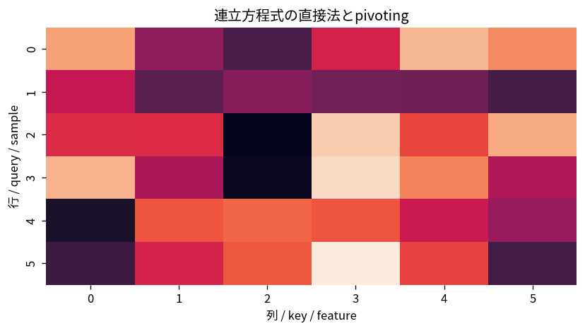

# 連立方程式の直接法とpivoting

Course 05｜数値計算｜Topic 09/20

---
layout: center
---

## 今回の問い

## 到達目標

- 定義と代表式を、自分の言葉と記号で説明できる。
- 成立条件を確認し、手計算と結果を検算できる。

## 理解確認

- 定義・条件・計算結果を自分の言葉で説明できるか確認する。

連立方程式の直接法とpivotingの代表式は、どの定義・仮定から、なぜその形になるのか。

---

## なぜ今これを学ぶのか

前Topic `num-numerical-integration-quadrature` で得た概念を使い、ここでは 連立方程式の直接法とpivoting へ進む。

---

## 直感

連立一次方程式を、解集合を変えない行基本変形で階段形へ整理する操作として見る。

---

## 図解

2変数または3変数の方程式を1行ずつ消去し、係数行列が三角化される過程を追う。 行列の各行は方程式、消去操作は解集合を変えない行基本変形である。pivot下を0にして三角形構造を作ることで、最後は後退代入だけで解ける。

---

## 記号と代表式

- $P$：row permutation
- $A$：係数行列
- $L$：unit lower triangular
- $U$：upper triangular

$$
\mathbf{P}\mathbf{A}=\mathbf{L}\mathbf{U}
$$

---

## 導出 1

第k列下を消す multiplier $l_{ik}=a_{ik}/a_{kk}$ をLに保存すると、消去操作の積をまとめてA=LUと表せる。

---

## 導出 2

pivotが0なら割れず、小さすぎれば丸め誤差を増幅。候補行を交換して大きいpivotを選ぶためPが入る。

---

## 例題

$A=\begin{pmatrix}0&1\\1&1\end{pmatrix}$ は最初pivot0。row swapでPを適用すれば消去可能。

---

## 条件を変えるとどうなるか

$A^{-1}b$ を明示inverseで計算するのは通常solveより高cost・不安定。理論式と数値algorithmを区別する。

---

## よくある誤解

連立方程式の直接法とpivotingでは、式へ数値を代入するだけでは不十分である。$A^{-1}b$ を明示inverseで計算するのは通常solveより高cost・不安定。理論式と数値algorithmを区別する。 という失敗例が示すように、式を使える条件と結論の範囲を区別する必要がある。

---

## 実装・計算上の注意

partial pivotingが標準。sparseではfill-inを減らすpermutationも重要。residualとbackward errorで検算する。

---

## 一段先へ

大規模sparse系ではfactorization cost/memoryが重く、matrix-vector product中心のiterative solverへ進む。

---

## 自分で説明できるか

- 「消去をlower係数として保存」を式を見ずに説明できるか
- 「solveへ分解」までの論理を一段ずつ再現できるか
- 連立方程式の直接法とpivotingの条件を1つ外した反例を説明できるか

---
layout: center
---

## 教科書と演習

- [教科書](../../textbook/num-direct-solvers-pivoting)
- [10問の演習](../../exercises/num-direct-solvers-pivoting)
