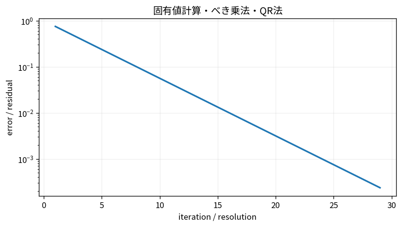

# 固有値計算・べき乗法・QR法

Course 05｜数値計算｜Topic 13/20

---
layout: center
---

## 今回の問い

## 到達目標

- 定義と代表式を、自分の言葉と記号で説明できる。
- 成立条件を確認し、手計算と結果を検算できる。

## 理解確認

- 定義・条件・計算結果を自分の言葉で説明できるか確認する。

固有値計算・べき乗法・QR法の代表式は、どの定義・仮定から、なぜその形になるのか。

---

## なぜ今これを学ぶのか

前Topic `num-least-squares-qr-svd` で得た概念を使い、ここでは 固有値計算・べき乗法・QR法 へ進む。

---

## 直感

固有値計算では全成分を解くより、支配的な方向を反復で増幅する考え方が使える。

---

## 図解

べき乗法でベクトルが最大固有値の固有方向へ揃う過程を見る。 反復でベクトルをAへ何度も掛けると、絶対値最大固有値に対応する成分が相対的に支配する。正規化を挟むことで方向だけを追跡するのがpower iterationである。

---

## 記号と代表式

- $A v_i=\lambda_i v_i$
- $x_k$：power iteration vector
- $\lambda_1$：絶対値最大固有値（単純と仮定）

$$
\mathbf{x}_{k+1}=\frac{\mathbf{A}\mathbf{x}_k}{\|\mathbf{A}\mathbf{x}_k\|_2}
$$

---

## 導出 1

$x_0=\sum c_i v_i$ とすれば $A^k x_0=\sum c_i\lambda_i^k v_i$。

---

## 導出 2

$\lambda_1^k[c_1v_1+\sum_{i>1}c_i(\lambda_i/\lambda_1)^k v_i]$。$|\lambda_i/\lambda_1|<1$ なら後項が消える。

---

## 例題

A=diag(5,2), x0=(1,1)。A^k x0=(5^k,2^k)、normalizeすると(1,0)方向へ。error ratioは(2/5)^k。

---

## 条件を変えるとどうなるか

x0がdominant eigenvectorに完全直交（係数c1=0）ならその成分は永遠に生成されずdominantへ収束しない。

---

## よくある誤解

固有値計算・べき乗法・QR法では、式へ数値を代入するだけでは不十分である。x0がdominant eigenvectorに完全直交（係数c1=0）ならその成分は永遠に生成されずdominantへ収束しない。 という失敗例が示すように、式を使える条件と結論の範囲を区別する必要がある。

---

## 実装・計算上の注意

QR algorithmは全eigenvalue用。sparse大型ではLanczos/Arnoldi。residual $\|Av-\lambda v\|$ を必ず確認。

---

## 一段先へ

singular valuesはA^TAのeigenvalue平方根だが、数値計算ではA^TAを直接形成しないSVD algorithmを使う。

---

## 自分で説明できるか

- 「固有basisへ展開」を式を見ずに説明できるか
- 「normalize」までの論理を一段ずつ再現できるか
- 固有値計算・べき乗法・QR法の条件を1つ外した反例を説明できるか

---
layout: center
---

## 教科書と演習

- [教科書](../../textbook/num-eigenvalue-power-qr)
- [10問の演習](../../exercises/num-eigenvalue-power-qr)
