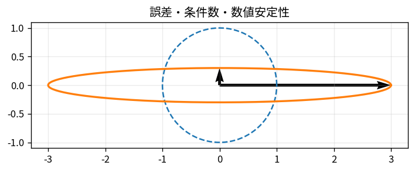

# 誤差・条件数・数値安定性

Course 05｜数値計算｜Topic 02/20

---
layout: center
---

## 今回の問い

## 到達目標

- 定義と代表式を、自分の言葉と記号で説明できる。
- 成立条件を確認し、手計算と結果を検算できる。

## 理解確認

- 定義・条件・計算結果を自分の言葉で説明できるか確認する。

誤差・条件数・数値安定性の代表式は、どの定義・仮定から、なぜその形になるのか。

---

## なぜ今これを学ぶのか

前Topic `num-floating-point-rounding` で得た概念を使い、ここでは 誤差・条件数・数値安定性 へ進む。

---

## 直感

条件数は入力の小さな誤差が出力でどれだけ増幅され得るかを表す。

---

## 図解

細長い楕円状の変換で、近い右辺が大きく違う解へ移る様子を見る。 入力空間の小さな円が線形写像で細長い楕円へ移る。最長軸と最短軸の比が大きいほど、入力方向によって増幅率が大きく違い、逆問題が敏感になる。

---

## 記号と代表式

- $\mathbf A\mathbf x=\mathbf b$：解く問題
- $\Delta\mathbf b$：入力摂動
- $\Delta\mathbf x$：解の変化
- $\kappa(\mathbf A)=\|A\|\|A^{-1}\|$：条件数

$$
\frac{\|\Delta\mathbf{x}\|}{\|\mathbf{x}\|}\lesssim\kappa(\mathbf{A})\frac{\|\Delta\mathbf{b}\|}{\|\mathbf{b}\|}
$$

---

## 導出 1

$A(x+\Delta x)=b+\Delta b$ と元式を引くと $A\Delta x=\Delta b$、よって $\Delta x=A^{-1}\Delta b$。

---

## 導出 2

$\|\Delta x\|\le\|A^{-1}\|\|\Delta b\|$。一方 $\|b\|=\|Ax\|\le\|A\|\|x\|$ より $1/\|x\|\le\|A\|/\|b\|$。

---

## 例題

$A=diag(1,10^{-6})$ は2-norm条件数 $10^6$。第2成分方向の小さなb誤差がxで百万倍の相対scale差を持ち得る。

---

## 条件を変えるとどうなるか

「結果が悪い=algorithmが悪い」とは限らない。ill-conditioned問題ではどの高品質algorithmでも入力の有効桁以上は回復できない。

---

## よくある誤解

誤差・条件数・数値安定性では、式へ数値を代入するだけでは不十分である。「結果が悪い=algorithmが悪い」とは限らない。ill-conditioned問題ではどの高品質algorithmでも入力の有効桁以上は回復できない。 という失敗例が示すように、式を使える条件と結論の範囲を区別する必要がある。

---

## 実装・計算上の注意

residual $r=b-A\hat x$ が小さくてもforward errorが小さいとは限らない。condition numberとbackward errorを併用する。

---

## 一段先へ

誤差列が0へ近づく速さを収束次数として定量化し、反復法の停止を設計する。

---

## 自分で説明できるか

- 「摂動した方程式」を式を見ずに説明できるか
- 「相対誤差を結ぶ」までの論理を一段ずつ再現できるか
- 誤差・条件数・数値安定性の条件を1つ外した反例を説明できるか

---
layout: center
---

## 教科書と演習

- [教科書](../../textbook/num-errors-conditioning-stability)
- [10問の演習](../../exercises/num-errors-conditioning-stability)
