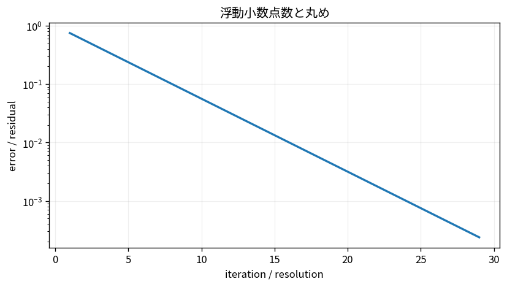

# 浮動小数点数と丸め

Course 05｜数値計算｜Topic 01/20

---
layout: center
---

## 今回の問い

## 到達目標

- 定義と代表式を、自分の言葉と記号で説明できる。
- 成立条件を確認し、手計算と結果を検算できる。

## 理解確認

- 定義・条件・計算結果を自分の言葉で説明できるか確認する。

浮動小数点数と丸めの代表式は、どの定義・仮定から、なぜその形になるのか。

---

## なぜ今これを学ぶのか

Course 05 の入口として、浮動小数点数と丸め を定義から組み立てる。

---

## 直感

浮動小数点は実数を有限ビットで近似するため、演算ごとに丸め誤差が入る。

---

## 図解

0.1を繰り返し加えた誤差や桁落ちを対数スケールで見る。 真値と浮動小数点表現の差が各演算で小さく発生し、演算の並べ方によって蓄積・相殺される。近い数の減算では有効桁が失われる様子を数値差として示す。

---

## 記号と代表式

- $x$：実数としての真値
- $\operatorname{fl}(x)$：浮動小数点で丸めた値
- $u$：unit roundoff
- $\delta$：相対丸め誤差

$$
\operatorname{fl}(x)=x(1+\delta),\quad |\delta|\le u
$$

---

## 導出 1

浮動小数点はsignificandのbit数が有限なので、ある指数帯では表現可能数が一定間隔で並ぶ。真値は最寄りの表現可能数へ丸められる。

---

## 導出 2

正規化数ではspacingが値の大きさに比例するため、絶対誤差より $|fl(x)-x|/|x|$ を使うと指数帯によらずおよそ一定上限uで抑えられる。

---

## 例題

十進3桁で1.2345を丸めると1.23。相対誤差は約0.00365。値のscaleが変わると絶対誤差は変わるが相対誤差の考えは保たれる。

---

## 条件を変えるとどうなるか

underflow/overflow/subnormalでは単純な相対誤差modelがそのまま成立しない。NaN/Infも実数演算にはない状態。

---

## よくある誤解

浮動小数点数と丸めでは、式へ数値を代入するだけでは不十分である。underflow/overflow/subnormalでは単純な相対誤差modelがそのまま成立しない。NaN/Infも実数演算にはない状態。 という失敗例が示すように、式を使える条件と結論の範囲を区別する必要がある。

---

## 実装・計算上の注意

dtype、machine epsilon、rounding、overflow範囲を確認する。等号比較を許容誤差へ置き換えるときも、絶対/相対tolを問題scaleに合わせる。

---

## 一段先へ

丸め誤差そのものと、問題が入力誤差を増幅するconditioning、algorithmが追加誤差を増幅するstabilityを次Topicで分離する。

---

## 自分で説明できるか

- 「有限桁表現から量子化幅が生じる」を式を見ずに説明できるか
- 「1+δ model」までの論理を一段ずつ再現できるか
- 浮動小数点数と丸めの条件を1つ外した反例を説明できるか

---
layout: center
---

## 教科書と演習

- [教科書](../../textbook/num-floating-point-rounding)
- [10問の演習](../../exercises/num-floating-point-rounding)
