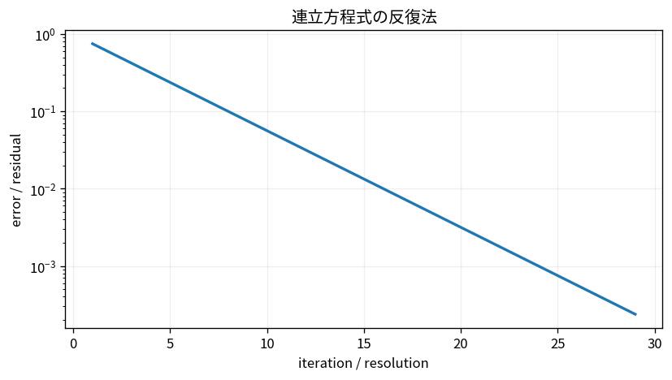

# 連立方程式の反復法

Course 05｜数値計算｜Topic 10/20

---
layout: center
---

## 今回の問い

## 到達目標

- 定義と代表式を、自分の言葉と記号で説明できる。
- 成立条件を確認し、手計算と結果を検算できる。

## 理解確認

- 定義・条件・計算結果を自分の言葉で説明できるか確認する。

連立方程式の反復法の代表式は、どの定義・仮定から、なぜその形になるのか。

---

## なぜ今これを学ぶのか

前Topic `num-direct-solvers-pivoting` で得た概念を使い、ここでは 連立方程式の反復法 へ進む。

---

## 直感

反復線形解法は現在の近似から次の近似を作り、残差を減らして解へ近づく。

---

## 図解

反復ごとの残差ノルムを半対数グラフで追う。 各反復点は現在の近似解、真の解との差よりも残差b-Axの減少を直接観測する。スペクトル性質が反復方向ごとの誤差減衰率を決める。

---

## 記号と代表式

- $x^{(k)}$：k反復目
- $M$：iteration matrix
- $c$：定数vector
- $\rho(M)$：spectral radius

$$
\mathbf{x}^{(k+1)}=\mathbf{M}\mathbf{x}^{(k)}+\mathbf{c}
$$

---

## 導出 1

解x*が $x*=Mx*+c$ を満たすようAのsplitからM,cを作る。

---

## 導出 2

反復式からfixed point式を引くと $e^{k+1}=Me^k=M^{k+1}e^0$。

---

## 例題

単純な2×2 JacobiでMのspectral radius0.5ならerrorのdominant成分は概ね毎回半減。

---

## 条件を変えるとどうなるか

残差が単調に減るとは限らず、ρ(M)>1なら初期値によって発散。反復回数上限で止まっただけを収束と呼ばない。

---

## よくある誤解

連立方程式の反復法では、式へ数値を代入するだけでは不十分である。残差が単調に減るとは限らず、ρ(M)>1なら初期値によって発散。反復回数上限で止まっただけを収束と呼ばない。 という失敗例が示すように、式を使える条件と結論の範囲を区別する必要がある。

---

## 実装・計算上の注意

matrixを明示factorizeせずmatvecだけ実装できるmatrix-free法がある。stopはpreconditioned residual等の定義をlibrary仕様で確認。

---

## 一段先へ

収束を劇的に改善するため、同じ解を持つがconditionの良い系へ変換するpreconditioningへ。

---

## 自分で説明できるか

- 「fixed point条件」を式を見ずに説明できるか
- 「spectral radius」までの論理を一段ずつ再現できるか
- 連立方程式の反復法の条件を1つ外した反例を説明できるか

---
layout: center
---

## 教科書と演習

- [教科書](../../textbook/num-iterative-linear-solvers)
- [10問の演習](../../exercises/num-iterative-linear-solvers)
