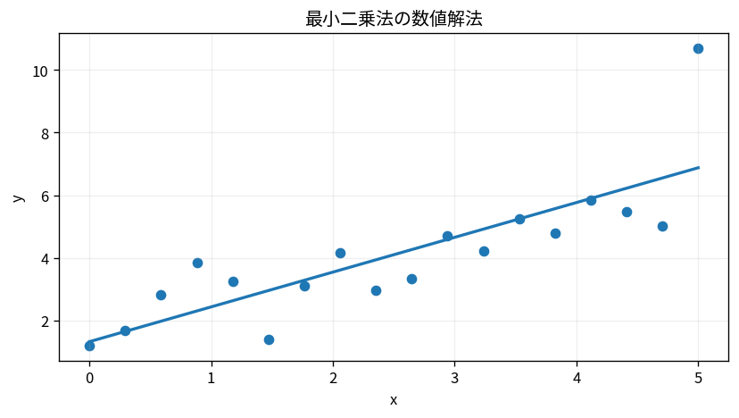

# 最小二乗法の数値解法

Course 05｜数値計算｜Topic 12/20

---
layout: center
---

## 今回の問い

## 到達目標

- 定義と代表式を、自分の言葉と記号で説明できる。
- 成立条件を確認し、手計算と結果を検算できる。

## 理解確認

- 定義・条件・計算結果を自分の言葉で説明できるか確認する。

最小二乗法の数値解法の代表式は、どの定義・仮定から、なぜその形になるのか。

---

## なぜ今これを学ぶのか

前Topic `num-sparse-matrices-preconditioning` で得た概念を使い、ここでは 最小二乗法の数値解法 へ進む。

---

## 直感

方程式を厳密に満たせないとき、残差ベクトルの長さを最小にする近似解を選ぶ。

---

## 図解

散布点へ直線を当て、縦方向の残差平方和が最小になる線を比較する。 観測ベクトルbをAの列空間へ直交射影した点がA x_hatで、残差r=b-A x_hatは列空間に垂直になる。QRはこの直交座標を数値的に安定に作る。

---

## 記号と代表式

- $A\in\mathbb R^{m\times n},m\ge n$
- $Q^TQ=I$
- $R$：upper triangular
- $r=b-Ax$：residual

$$
\mathbf{A}=\mathbf{Q}\mathbf{R},\quad\min\|\mathbf{R}\mathbf{x}-\mathbf{Q}^{\mathsf T}\mathbf{b}\|_2
$$

---

## 導出 1

$\|Ax-b\|=\|QRx-b\|=\|Q^Tb-Rx\|$（full Qなら直交変換が2-norm保存）。

---

## 導出 2

thin QRではbをQ列空間成分 $Q^Tb$ と直交残差へ分ける。xで変えられるのは列空間成分だけ。

---

## 例題

Aの列がほぼ依存だとκ(A)=10^6ならκ(A^TA)≈10^12。normal equationは有効桁を大きく失う一方QRが有利。

---

## 条件を変えるとどうなるか

理論上同じ解式でもfloating-pointでは同じ精度ではない。$(A^TA)^{-1}A^Tb$ を標準実装としない。

---

## よくある誤解

最小二乗法の数値解法では、式へ数値を代入するだけでは不十分である。理論上同じ解式でもfloating-pointでは同じ精度ではない。$(A^TA)^{-1}A^Tb$ を標準実装としない。 という失敗例が示すように、式を使える条件と結論の範囲を区別する必要がある。

---

## 実装・計算上の注意

`lstsq`のdriver、rank threshold、residual返却条件を確認。explicit Qが不要ならHouseholder reflectorsをcompactに保存する。

---

## 一段先へ

SVDはrankと感度をsingular valueで直接見せ、low-rank computationへつながる。

---

## 自分で説明できるか

- 「QRで残差normを変換」を式を見ずに説明できるか
- 「R系を解く」までの論理を一段ずつ再現できるか
- 最小二乗法の数値解法の条件を1つ外した反例を説明できるか

---
layout: center
---

## 教科書と演習

- [教科書](../../textbook/num-least-squares-qr-svd)
- [10問の演習](../../exercises/num-least-squares-qr-svd)
