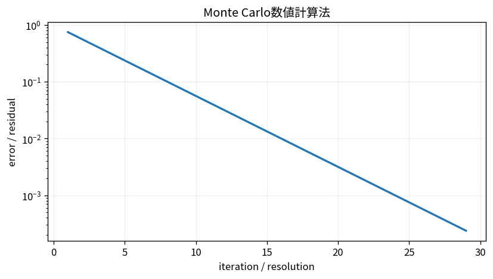

# Monte Carlo数値計算法

Course 05｜数値計算｜Topic 19/20

---
layout: center
---

## 今回の問い

## 到達目標

- 定義と代表式を、自分の言葉と記号で説明できる。
- 成立条件を確認し、手計算と結果を検算できる。

## 理解確認

- 定義・条件・計算結果を自分の言葉で説明できるか確認する。

Monte Carlo数値計算法の代表式は、どの定義・仮定から、なぜその形になるのか。

---

## なぜ今これを学ぶのか

前Topic `num-ode-stability-stiffness` で得た概念を使い、ここでは Monte Carlo数値計算法 へ進む。

---

## 直感

Monte Carlo法は期待値をランダム標本の平均で近似し、次元に依存しにくい一方で収束は約1/√n。

---

## 図解

標本数を増やしながら積分推定値と信頼区間が収束する様子を見る。 乱数で得た標本平均が真の期待値の周囲へ集まる。標本数Nを増やしたとき誤差の典型的な大きさが1/√Nで縮むため、収束は次元に強い一方で遅い。

---

## 記号と代表式

- $X_i\sim p$：独立sample
- $I=E[f(X)]$：積分/期待値
- $\hat I_n=n^{-1}\sum f(X_i)$：Monte Carlo estimator

$$
\hat{I}_n=\frac{1}{n}\sum_{i=1}^{n}f(X_i)
$$

---

## 導出 1

$I=\int f(x)p(x)dx=E_p[f(X)]$。

---

## 導出 2

独立sampleの平均はunbiasedで $E[\hat I]=I$。

---

## 例題

π推定：unit squareにuniform sampleしquarter circle indicator平均を4倍。n4倍でtypical error半分。

---

## 条件を変えるとどうなるか

1/√n収束は遅い。精度を10倍にするにはsample約100倍。sampleが強く相関しているとeffective sample sizeも減る。

---

## よくある誤解

Monte Carlo数値計算法では、式へ数値を代入するだけでは不十分である。1/√n収束は遅い。精度を10倍にするにはsample約100倍。sampleが強く相関しているとeffective sample sizeも減る。 という失敗例が示すように、式を使える条件と結論の範囲を区別する必要がある。

---

## 実装・計算上の注意

seedだけでなくgenerator、sample数、confidence intervalを記録。parallel RNG streamの独立性にも注意。

---

## 一段先へ

最後に、理論orderが実装でも観測されるかをverification/benchmarkで体系的に確認する。

---

## 自分で説明できるか

- 「積分を期待値へ」を式を見ずに説明できるか
- 「分散」までの論理を一段ずつ再現できるか
- Monte Carlo数値計算法の条件を1つ外した反例を説明できるか

---
layout: center
---

## 教科書と演習

- [教科書](../../textbook/num-monte-carlo-methods)
- [10問の演習](../../exercises/num-monte-carlo-methods)
