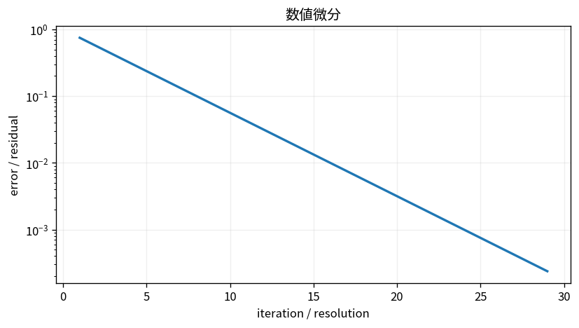

# 数値微分

Course 05｜数値計算｜Topic 07/20

---
layout: center
---

## 今回の問い

## 到達目標

- 定義と代表式を、自分の言葉と記号で説明できる。
- 成立条件を確認し、手計算と結果を検算できる。

## 理解確認

- 定義・条件・計算結果を自分の言葉で説明できるか確認する。

数値微分の代表式は、どの定義・仮定から、なぜその形になるのか。

---

## なぜ今これを学ぶのか

前Topic `num-splines-piecewise-approximation` で得た概念を使い、ここでは 数値微分 へ進む。

---

## 直感

有限差分は微分を近傍点の差で近似し、刻み幅hに打切り誤差と丸め誤差のトレードオフがある。

---

## 図解

hを変えて近似誤差がU字型になる様子を見る。 真の関数と近似関数の縦の差が局所誤差である。近似次数や刻み幅を変えたとき、その差が理論上の次数どおり縮むかを図で確認する。

---

## 記号と代表式

- $h$：有限差分step
- $f^{\prime}(x)$：求める導関数
- 截断誤差：Taylor高次項を捨てた誤差
- 丸め誤差：有限精度による誤差

$$
f^{\prime}(x)\approx\frac{f(x+h)-f(x-h)}{2h}
$$

---

## 導出 1

$f(x\pm h)=f(x)\pm hf^{\prime}(x)+h^2f^{\prime\prime}/2\pm h^3f^{(3)}/6+\cdots$。

---

## 導出 2

$f(x+h)-f(x-h)=2hf^{\prime}(x)+h^3f^{(3)}(x)/3+\cdots$。

---

## 例題

$f(x)=x^2$, x=1なら中心差分は任意hで [(1+h)²-(1-h)²]/2h=2 とexact。

---

## 条件を変えるとどうなるか

「hは小さいほど良い」は誤り。subtraction cancellationによりroundoff項およそO(u/h)が増える。

---

## よくある誤解

数値微分では、式へ数値を代入するだけでは不十分である。「hは小さいほど良い」は誤り。subtraction cancellationによりroundoff項およそO(u/h)が増える。 という失敗例が示すように、式を使える条件と結論の範囲を区別する必要がある。

---

## 実装・計算上の注意

automatic differentiationはfinite differenceと異なり、演算graphのchain ruleでmachine precision精度の導関数を得る。gradient checkには中心差分を使える。

---

## 一段先へ

積分も局所近似を区間全体へ足すことで数値化できる。

---

## 自分で説明できるか

- 「前後Taylor展開」を式を見ずに説明できるか
- 「2hで割る」までの論理を一段ずつ再現できるか
- 数値微分の条件を1つ外した反例を説明できるか

---
layout: center
---

## 教科書と演習

- [教科書](../../textbook/num-numerical-differentiation)
- [10問の演習](../../exercises/num-numerical-differentiation)
