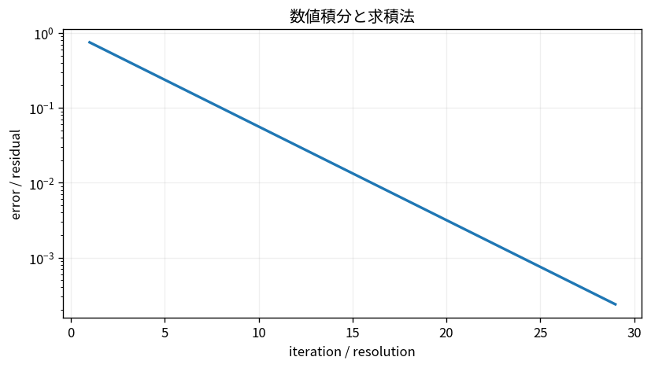
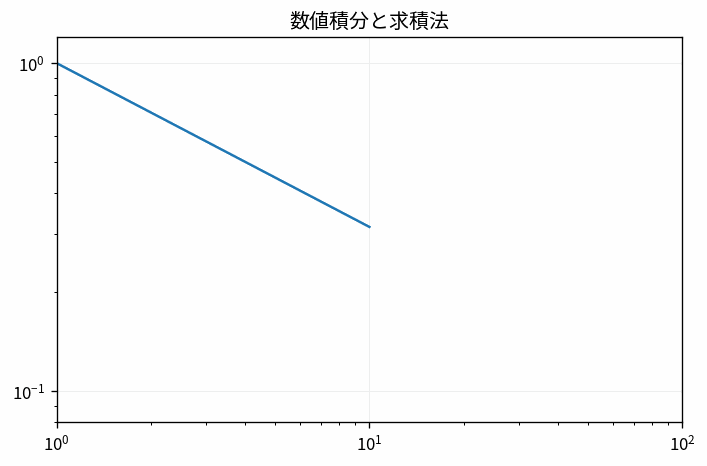

# 数値積分と求積法

Course 05｜数値計算

---
layout: center
---

## 今回の問い

数値積分と求積法で、何を入力し、代表式がどの量を出力し、どの成立条件を外すと結果が壊れるのか。

---

## 到達目標

- 数値積分と求積法の定義と代表式を言葉で説明できる
- 図と式の対応を説明できる
- 小さな例で成立条件と失敗条件を検算できる

---

## 直感

数値積分は曲線下を有限個の簡単な面積へ分割して足し合わせる。

**前提:** num-errors-conditioning-stability, calc-integrals-fundamental-theorem, num-polynomial-interpolation

---

## 図解

---

## 図を見るポイント

- 軸・node・矢印・領域が何を表すか確認する
- 代表式の各項と図の要素を対応づける
- 条件を変えたとき、どこが変化するか予測する

---

## 代表式

$$
\int_a^bf(x)dx\approx\frac{h}{2}[f(a)+2\sum f(x_i)+f(b)]
$$

左辺の出力 → 右辺の操作 → 入力の型の順で読む。

---

## 式をどう読むか

- **対象:** 数値積分、求積法
- shape・次元・定義域を先に確定する
- 計算後に符号・大きさ・残差・確率などを図と照合する

---

## 小さな例

台形則の分割数を増やし、真の面積へ近づく様子を見る。

最小の非自明な設定で、手計算と実装を照合する。

---

## 動き／思考実験で確認

- 各frameで、何が固定され何が更新されるかを追う。

---

## 成立条件

- 滑らかさで収束次数が変わる。
- 刻み幅と評価点数を混同しない。
- 数値積分と求積法の定義と計算手順を区別し、数値例だけで一般性を判断しない。

---

## よくある誤解

- 数値積分と求積法の定義と計算手順を同一視する
- 成立条件を確認せず公式を適用する
- 数学上の次元と配列のshapeを混同する

---

## 数値・実装で検算

1. 小さい入力を作る
2. 定義式から期待値を手で求める
3. NumPy等の実装結果と比較する
4. shape・残差・許容誤差・seedを記録する

---

## 後続分野への接続

数値積分と求積法は、後続の数値計算・データ解析・機械学習で前提となる。

このTopicの量が、後続で入力・目的関数・制約・診断のどれとして使われるか確認する。

---

## 理解確認

- 数値積分と求積法を図→式→小例の順で説明できるか
- 条件を1つ外した反例を作れるか

[教科書](../../textbook/num-numerical-integration-quadrature)

[10問の演習](../../exercises/num-numerical-integration-quadrature)
