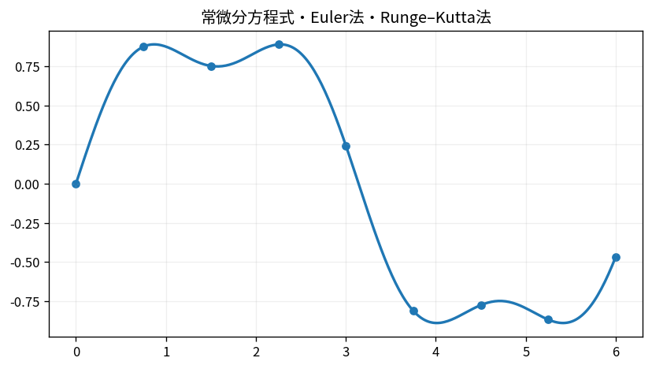

# 常微分方程式・Euler法・Runge–Kutta法

Course 05｜数値計算｜Topic 17/20

---
layout: center
---

## 今回の問い

## 到達目標

- 定義と代表式を、自分の言葉と記号で説明できる。
- 成立条件を確認し、手計算と結果を検算できる。

## 理解確認

- 定義・条件・計算結果を自分の言葉で説明できるか確認する。

常微分方程式・Euler法・Runge–Kutta法の代表式は、どの定義・仮定から、なぜその形になるのか。

---

## なぜ今これを学ぶのか

前Topic `num-randomized-numerical-linear-algebra` で得た概念を使い、ここでは 常微分方程式・Euler法・Runge–Kutta法 へ進む。

---

## 直感

ODE数値解法は微分方程式が与える局所傾きを短い時間ステップで積み重ねる。

---

## 図解

Euler法の折れ線と真の解を、刻み幅を変えながら比較する。 曲線が真の解、離散点が数値解である。各ステップでは現在点の微分方程式が与える傾きを使って次点を予測し、刻み幅が局所誤差と安定性の双方に効く。

---

## 記号と代表式

- $y^{\prime}=f(t,y)$：初期値問題
- $h$：time step
- $t_k=t_0+kh$
- $y_k\approx y(t_k)$

$$
y_{k+1}=y_k+h f(t_k,y_k)
$$

---

## 導出 1

$y(t+h)=y(t)+hy^{\prime}(t)+O(h^2)$。ODEから $y^{\prime}=f(t,y)$。

---

## 導出 2

$y(t+h)\approx y(t)+hf(t,y(t))$。真値y(t)を近似y_kで置換してEuler更新。

---

## 例題

$y^{\prime}=-y,y(0)=1,h=0.1$。Eulerでy1=0.9、y2=0.81。真値e^-0.2≈0.8187。

---

## 条件を変えるとどうなるか

hを粗くすると高精度法でも失敗。さらにstiff問題ではexplicit法が精度上十分小さくなくてもstabilityのため極小hを要求する。

---

## よくある誤解

常微分方程式・Euler法・Runge–Kutta法では、式へ数値を代入するだけでは不十分である。hを粗くすると高精度法でも失敗。さらにstiff問題ではexplicit法が精度上十分小さくなくてもstabilityのため極小hを要求する。 という失敗例が示すように、式を使える条件と結論の範囲を区別する必要がある。

---

## 実装・計算上の注意

adaptive solverはlocal error estimateからhを調整する。rtol/atol、event detection、dense outputの意味を確認。

---

## 一段先へ

次Topicでtest equationを使い、accuracyとは別のstability regionを調べる。

---

## 自分で説明できるか

- 「Taylor展開」を式を見ずに説明できるか
- 「局所からglobal error」までの論理を一段ずつ再現できるか
- 常微分方程式・Euler法・Runge–Kutta法の条件を1つ外した反例を説明できるか

---
layout: center
---

## 教科書と演習

- [教科書](../../textbook/num-ode-euler-runge-kutta)
- [10問の演習](../../exercises/num-ode-euler-runge-kutta)
