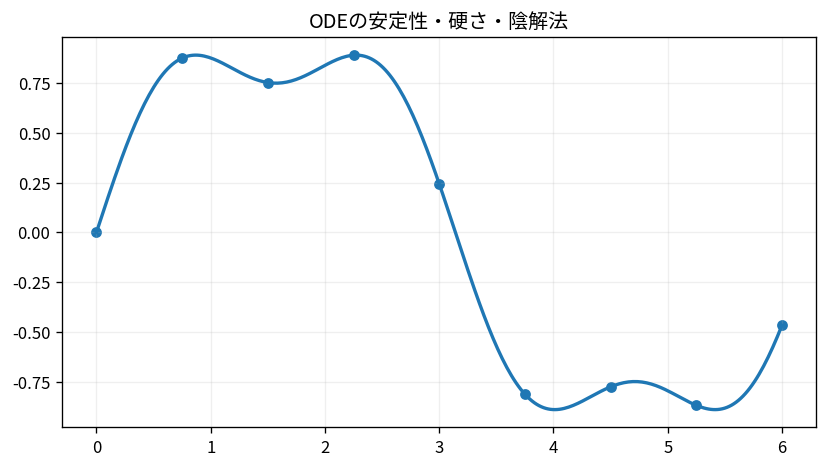

# ODEの安定性・硬さ・陰解法

Course 05｜数値計算｜Topic 18/20

---
layout: center
---

## 今回の問い

## 到達目標

- 定義と代表式を、自分の言葉と記号で説明できる。
- 成立条件を確認し、手計算と結果を検算できる。

## 理解確認

- 定義・条件・計算結果を自分の言葉で説明できるか確認する。

ODEの安定性・硬さ・陰解法の代表式は、どの定義・仮定から、なぜその形になるのか。

---

## なぜ今これを学ぶのか

前Topic `num-ode-euler-runge-kutta` で得た概念を使い、ここでは ODEの安定性・硬さ・陰解法 へ進む。

---

## 直感

ODE数値解法は微分方程式が与える局所傾きを短い時間ステップで積み重ねる。

---

## 図解

Euler法の折れ線と真の解を、刻み幅を変えながら比較する。 曲線が真の解、離散点が数値解である。各ステップでは現在点の微分方程式が与える傾きを使って次点を予測し、刻み幅が局所誤差と安定性の双方に効く。

---

## 記号と代表式

- $y^{\prime}=\lambda y$：test equation
- $z=h\lambda$
- $R(z)$：数値法のamplification factor

$$
y_{k+1}=y_k+h\lambda y_{k+1}
$$

---

## 導出 1

$y_{k+1}=(1+h\lambda)y_k$。反復で $|1+z|^k$ なので減衰には $|1+z|<1$。

---

## 導出 2

$y_{k+1}=y_k+h\lambda y_{k+1}$ を解いて $y_{k+1}=y_k/(1-z)$。負実λでは任意h>0でmodulus<1。

---

## 例題

λ=-100, h=0.05。explicit factor=1-5=-4で発散、真解は減衰。implicit factor=1/6で安定。

---

## 条件を変えるとどうなるか

implicit法は「無条件に正確」ではない。A-stableでも大hでは位相/振幅誤差が大きい。stabilityとaccuracyを区別する。

---

## よくある誤解

ODEの安定性・硬さ・陰解法では、式へ数値を代入するだけでは不十分である。implicit法は「無条件に正確」ではない。A-stableでも大hでは位相/振幅誤差が大きい。stabilityとaccuracyを区別する。 という失敗例が示すように、式を使える条件と結論の範囲を区別する必要がある。

---

## 実装・計算上の注意

stiff solver(BDF/Radau)のJacobian利用でcostが変わる。solver failure理由をstep underflow等まで記録。

---

## 一段先へ

ODE以外の高次元積分・期待値ではsamplingに基づくMonte Carloが別の数値道具として現れる。

---

## 自分で説明できるか

- 「explicit Euler」を式を見ずに説明できるか
- 「stiffness」までの論理を一段ずつ再現できるか
- ODEの安定性・硬さ・陰解法の条件を1つ外した反例を説明できるか

---
layout: center
---

## 教科書と演習

- [教科書](../../textbook/num-ode-stability-stiffness)
- [10問の演習](../../exercises/num-ode-stability-stiffness)
