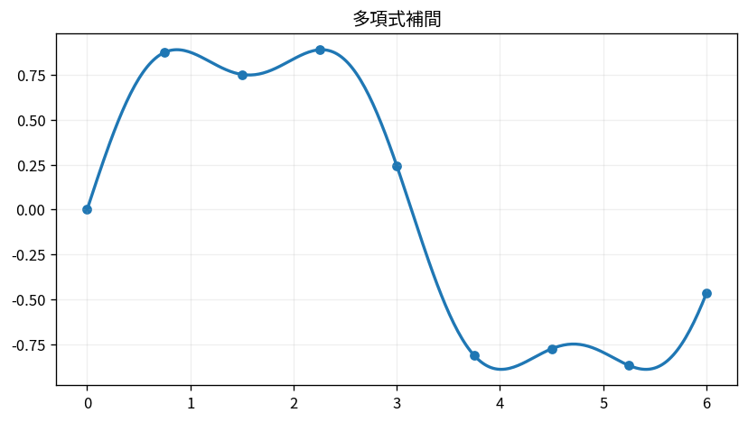

# 多項式補間

Course 05｜数値計算｜Topic 05/20

---
layout: center
---

## 今回の問い

## 到達目標

- 定義と代表式を、自分の言葉と記号で説明できる。
- 成立条件を確認し、手計算と結果を検算できる。

## 理解確認

- 定義・条件・計算結果を自分の言葉で説明できるか確認する。

多項式補間の代表式は、どの定義・仮定から、なぜその形になるのか。

---

## なぜ今これを学ぶのか

前Topic `num-root-finding` で得た概念を使い、ここでは 多項式補間 へ進む。

---

## 直感

補間は与えられた点を通る近似関数を構成し、区間内の値を推定する。

---

## 図解

同じ点に高次多項式と区分的splineを当て、振動の違いを見る。 点は必ず通るという制約を保ちながら、1本の高次多項式と区分的低次多項式では点間の振る舞いが異なる。端での振動は「点を通る」ことと「安定に近似する」ことが別である例である。

---

## 記号と代表式

- $(x_i,y_i)$：n+1個のdata点
- $p(x)$：次数n以下の補間多項式
- $L_i(x)$：i点だけ1、他点0になるLagrange基底

$$
p(x)=\sum_{i=0}^{n}y_iL_i(x)
$$

---

## 導出 1

$L_i(x_j)=\delta_{ij}$ なら線形結合 $\sum y_iL_i$ はx_jでy_jになる。

---

## 導出 2

$L_i(x)=\prod_{j\ne i}(x-x_j)/(x_i-x_j)$。j≠i点では分子0、x_iでは各因子1。

---

## 例題

点(0,1),(1,3)ならL0=1-x, L1=x、p=1(1-x)+3x=1+2x。

---

## 条件を変えるとどうなるか

x_iが重複すると分母 $x_i-x_j=0$。同一点で値だけ指定した通常補間は独立条件が不足する。

---

## よくある誤解

多項式補間では、式へ数値を代入するだけでは不十分である。x_iが重複すると分母 $x_i-x_j=0$。同一点で値だけ指定した通常補間は独立条件が不足する。 という失敗例が示すように、式を使える条件と結論の範囲を区別する必要がある。

---

## 実装・計算上の注意

Lagrange形を毎回素朴評価するよりbarycentric interpolationが安定・効率的。Vandermonde逆解法は悪条件化しやすい。

---

## 一段先へ

global高次数多項式の問題を避け、低次数多項式を区間ごとにつなぐsplineへ進む。

---

## 自分で説明できるか

- 「基底に欲しい性質を課す」を式を見ずに説明できるか
- 「一意性」までの論理を一段ずつ再現できるか
- 多項式補間の条件を1つ外した反例を説明できるか

---
layout: center
---

## 教科書と演習

- [教科書](../../textbook/num-polynomial-interpolation)
- [10問の演習](../../exercises/num-polynomial-interpolation)
